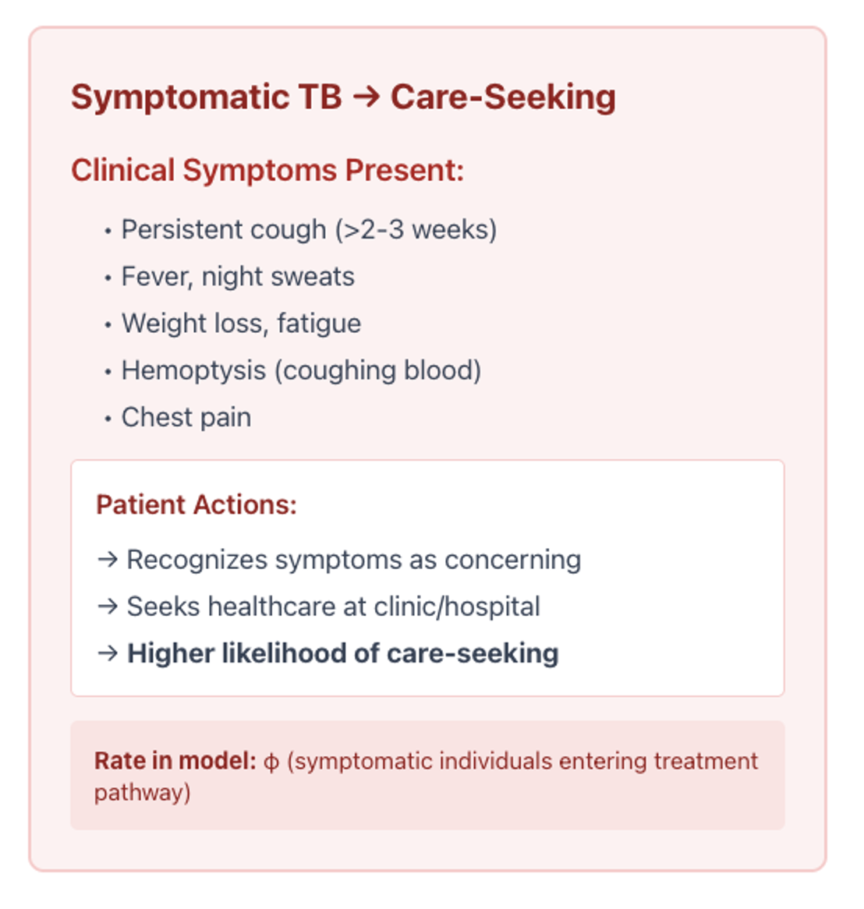

Health-Seeking Behavior
========================

.. currentmodule:: tbsim.interventions.healthseeking

This module provides patient delay modeling for TB care-seeking behavior (patient delay: from symptom recognition to first healthcare contact).

HealthSeekingBehavior Class
----------------------------

**Conceptual overview: Symptomatic TB → Care-Seeking** (what this intervention models)

   Clinical symptoms that drive care-seeking, patient actions (recognize symptoms, seek healthcare), and how the flow is represented in the model as a rate Φ (symptomatic individuals entering the treatment pathway).

.. autoclass:: HealthSeekingBehavior
   :members:
   :undoc-members:
   :show-inheritance:
   :special-members: __init__
