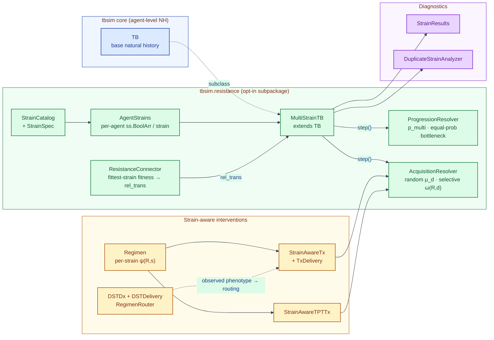
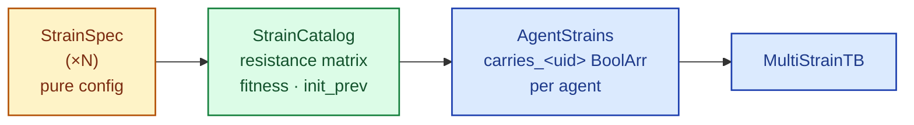
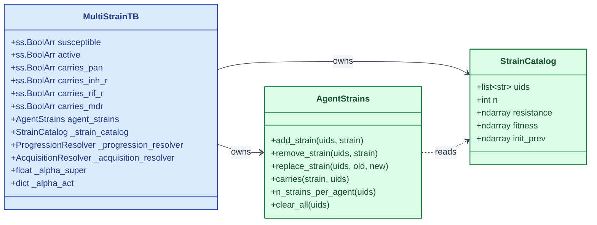
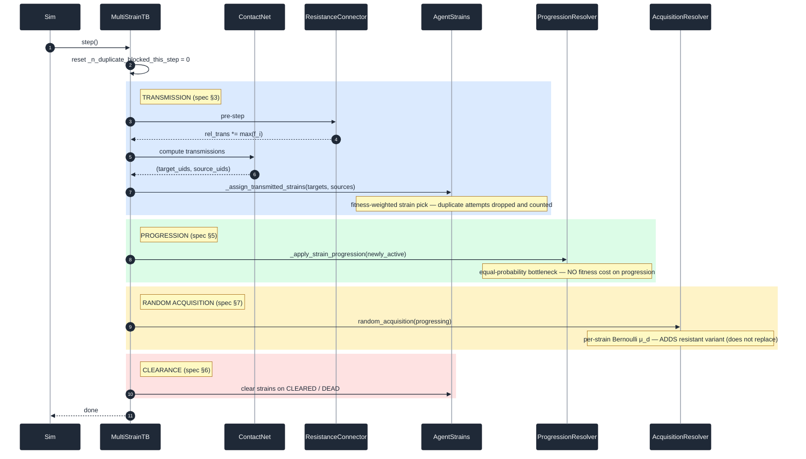
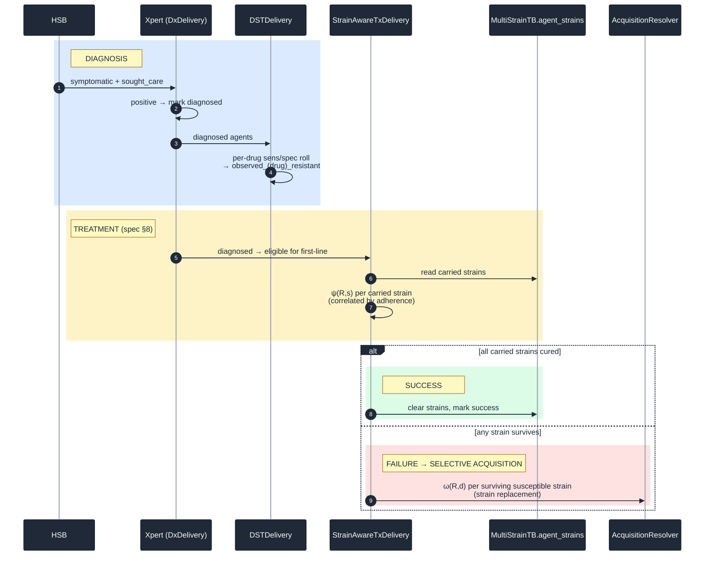
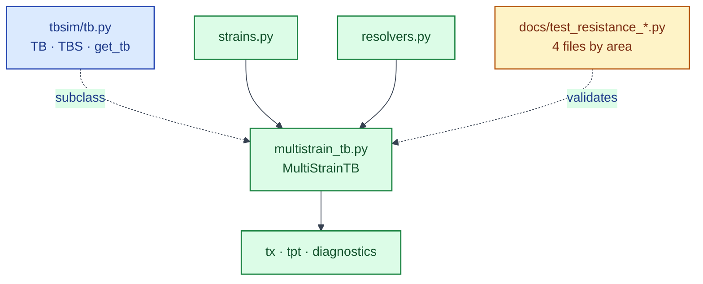

# TBsim Drug-Resistance Overlay — Architecture

> **Driver document**: `TBSim Resistance Technical Specifications` 
> This architecture shows how `tbsim.resistance` subpackage was implemented. 
> Every section number here
> maps to a section in the spec. Where the implementation diverges from
> the spec, the deviation is flagged in a **⚠ Deviation** call-out so it
> can be reviewed.

---

## 0. Big picture



**Legend** — 🟦 blue = core `TB` · 🟩 green = `tbsim.resistance` overlay ·
🟧 amber = strain-aware interventions · 🟪 purple = analyzers.

**Package boundary**

- `tbsim/tb.py` owns base `TB`, `TBS`, `get_tb`, and `choice2d` only.
- `tbsim/resistance/multistrain_tb.py` owns `MultiStrainTB` (strain hooks,
  superinfection, transmission assignment).
- `import tbsim` does **not** load resistance modules. Import explicitly:
  `from tbsim.resistance import MultiStrainTB, …`.
- Resistance modules reach core TB via relative imports (`from ..tb import …`),
  not `import tbsim`, keeping the dependency graph acyclic.

---

## 1. Strain profile (spec §"Individual strain resistance profiles")

### Spec

For *D* drug classes there are 2^D possible strains. Each strain has a
binary resistance phenotype vector `r ∈ {0,1}^D`. Strains are flexibly
defined; starting classes are RIF and BDQ, with INH, FQ, and other
second-line companion drugs as planned extensions.

### Implementation

| Spec concept                          | Code symbol                                     |
| ------------------------------------- | ----------------------------------------------- |
| Strain `i` with phenotype `r_i`       | `StrainSpec(uid, resistance={drug: 0/1}, …)`   |
| Catalog of strains                    | `StrainCatalog(specs)` (`tbsim/resistance/strains.py`) |
| Per-strain string id                    | `catalog.uids[i]`                              |
| Resistance matrix (n_strains × n_drugs) | `catalog.resistance`                         |
| Strain fitness `f_i`                  | `StrainSpec.fitness ∈ [0, 1]`                   |
| Seed prevalence among initial cases   | `StrainSpec.init_prev`                          |

The catalog validates uniqueness, infers the drug column ordering, and
pre-computes numpy arrays for fast vectorised lookups.

### 1.1 StrainSpec vs StrainCatalog vs AgentStrains

These three classes sit at different layers: **what a strain is**,
**the catalog of all strains**, and **who carries what during the sim**.
All three live in `tbsim/resistance/strains.py`.

| | **StrainSpec** | **StrainCatalog** | **AgentStrains** |
|---|---|---|---|
| **What it is** | One strain's definition | The full strain catalog | Per-agent "who carries which strain" state |
| **Scope** | Single strain | All strains in the model | All agents in the simulation |
| **Has sim state?** | No — pure config | No — lookup tables | Yes — `ss.BoolArr` on `MultiStrainTB` |
| **When you create it** | When you define strains | Once, from a list of specs | Once per `MultiStrainTB`, from the catalog |
| **Typical use** | `StrainSpec('pan', {'INH': 0, 'RIF': 0})` | `StrainCatalog([pan, inh_r, …])` | `agent_strains.add_strain(uids, 'pan')` |

#### StrainSpec — one strain's blueprint

A **declarative spec** for a single strain type. It describes properties
that do not change per agent:

- `uid` — unique strain key (e.g. `'pan_sus'`, `'rif_r'`); not a Starsim agent UID
- `label` — optional display name for plots (defaults to `uid`)
- `resistance` — drug phenotype (`{'INH': 1, 'RIF': 0}`)
- `fitness` — transmission cost (used by `ResistanceConnector`)
- `init_prev` — starting prevalence when seeding infections

No agents, no arrays, no simulation — just configuration.

#### StrainCatalog — the strain catalog

Collects many `StrainSpec` objects into **indexed, simulation-ready
tables**:

- Ordered list of `uids`
- Unified drug list across all strains
- NumPy arrays: `resistance` (n_strains × n_drugs), `fitness`, `init_prev`

Used anywhere the model needs "strain index 2 is resistant to RIF" — DST,
treatment efficacy, transmission sampling, etc.

```python
catalog = StrainCatalog([
    StrainSpec('pan',   {'INH': 0, 'RIF': 0}),
    StrainSpec('inh_r', {'INH': 1, 'RIF': 0}, fitness=0.95),
])
catalog.index('inh_r')        # -> 1
catalog.resistance[1, 0]      # -> 1 (INH-resistant)
```

#### AgentStrains — per-agent runtime state

Tracks **which agents carry which strains right now**. For each strain in
the catalog it creates a `ss.BoolArr` on `MultiStrainTB` named `carries_<uid>`:

- `carries_pan[agent_uids]` — does this agent carry pan-susceptible?
- `carries_inh_r[agent_uids]` — does this agent carry INH-resistant?

This is the **live simulation state** that changes as agents are
infected, treated, or cleared. It is attached to `MultiStrainTB` via
`define_states()`.

```python
agent_strains = AgentStrains(catalog)
agent_strains.attach(tb)
agent_strains.add_strain(infected_uids, 'pan')   # assign strain to agents
agent_strains.carriers('inh_r')                  # uids currently carrying inh_r
```

#### Why `AgentStrains` is not a bitmask

The earlier `ck_resistance` prototype stored each agent's carried strains in a
single integer bitmask (`strain_mask`). In that representation, bit `j` meant
"this agent carries strain `j`"; for example, binary `0101` meant the agent
carried strains 0 and 2. This is compact and fast for a small, fixed, fully
enumerated strain universe.

The production overlay uses named `ss.BoolArr` state instead:

```text
carries_pan
carries_inh_r
carries_mdr
...
```

This is less compact than one integer, but it matches Starsim's state model,
keeps strain names visible in results and debugging, and supports arbitrary
`StrainSpec` catalogs without forcing users to reason about binary encodings.
The bitmask implementation remains useful as a reference for ODE-facing
operator tests, but it is not the runtime representation in this branch.

#### How they fit together

```
StrainSpec (×N)  →  StrainCatalog  →  AgentStrains (on MultiStrainTB)
   "what strains        "catalog for        "agent 42 carries
    exist?"              fast lookup"         pan + inh_r"
```

**Analogy:** `StrainSpec` is a disease variant on paper;
`StrainCatalog` is the lab's strain library index; `AgentStrains` is
each patient's chart showing which variants they currently harbor.



---

## 2. Multi-strain infections (spec §"Allow for multi-strain infections")

### Spec

Each agent carries a strain profile $S_A = \{r_{i_1}, r_{i_2}, …\}$;
length 0 = uninfected. Examples in the spec: Agent A with a single
RIF-resistant strain; Agent B with one pan-susceptible + one RIF+FQ-
resistant strain.

### Implementation

`AgentStrains` (`tbsim/resistance/strains.py`) attaches one
`ss.BoolArr` per strain directly to `MultiStrainTB` under the name
`carries_<strain_name>`:



`ss.BoolArr` was chosen so population births and deaths resize the
strain state automatically; no custom mask bookkeeping.

---

## 3. Transmission (spec §"Transmission")

### Spec — three sub-rules

1. Susceptible agents acquire the **same strain profile as the infecting
   agent** (no emergence of resistance during transmission events).
2. Single-strain infector: probability of transmission per contact =
   $\beta \cdot f_i$ where $f_i \le 1$ is the fitness of strain *i*.
3. Super-infected infector: overall probability of transmission per
   contact equals the **fittest** strain's fitness; conditional on
   transmission, a multinomial over the infector's carried strains
   chooses which strain is passed.

### Implementation

| Spec rule                                                | Code                                                                          |
| -------------------------------------------------------- | ----------------------------------------------------------------------------- |
| Multiplicative `f_i` on FOI (single-strain infector)     | `ResistanceConnector.step` multiplies `tb.rel_trans` by per-agent fitness.   |
| Super-infected → fittest strain's fitness                | `AgentStrains.effective_rel_trans` returns the max fitness across carriers. |
| Multinomial pick of transmitted strain                   | `AgentStrains.sample_transmitted_strain` weights carriers by fitness.        |
| No emergence during transmission                         | `_assign_transmitted_strains` only copies an existing source strain.          |

**Per-step lifecycle:**



**Legend** — 🟦 blue = transmission · 🟩 green = progression ·
🟨 yellow = random acquisition · 🟥 red = clearance.

### Superinfection via transmission (landed)

Stock `ss.Infection` only selects **susceptible** agents as transmission
recipients. `MultiStrainTB.infect()` overrides this so already-infected
agents become eligible recipients with `rel_sus` scaled by their α factor:

```
INFECTION       → α_super        (default 0.21)
NON_INFECTIOUS  → α_act_noninf   (default 0.0)
ASYMPTOMATIC    → α_act_asympt   (default 0.0)
SYMPTOMATIC     → α_act_sympt    (default 0.0)
```

`set_prognoses` branches: new infections (recipient was SUSCEPTIBLE or
CLEARED) follow the original path (mark infected, state → INFECTION),
while superinfections only add the transmitted strain — the recipient's
TB state and timers are preserved.

---

## 4. Strain competition and protection against reinfection (spec §"Strain competition")

### Spec

Currently-infected agents are protected against superinfection by a
multiplicative factor $\alpha_{\text{super}}$ (strain-agnostic and
agnostic to the number of strains an agent already carries). Default
$\alpha_{\text{super}} = 1 - \pi$ where $\pi$ is `rr_reinfection_rec`.
Active-TB states have their own (more restrictive) factors
$\alpha_{\text{act, sympt}}$, $\alpha_{\text{act, asympt}}$,
$\alpha_{\text{act, noninf}}$ — defaults all 0 (active-disease agents
cannot be superinfected).

Duplicate-strain superinfection is **not allowed** (an agent cannot end
up with two identical strains). Implication: low-prevalence strains may
be slightly favoured because duplicate hits on common strains are
dropped. The spec asks for an analyzer that counts how often this would
have mattered.

### Implementation

| Spec concept                                   | Code symbol                                              |
| ---------------------------------------------- | -------------------------------------------------------- |
| $\alpha_{\text{super}}$                        | `MultiStrainTB._alpha_super` (default `0.21` ≡ `1 - rr_reinfection_rec`) |
| $\alpha_{\text{act, *}}$                       | `MultiStrainTB._alpha_act = {non_infectious, asymptomatic, symptomatic}` (defaults 0) |
| Duplicate-strain block                         | `_assign_transmitted_strains`: incoming strain is dropped if recipient already carries it |
| Bias analyzer                                  | `DuplicateStrainAnalyzer` reads `MultiStrainTB._n_duplicate_blocked_this_step` and reports `n_duplicate_blocked` and `cum_duplicate_blocked` |

### ⚠ Deviation 4.1 — resolved

α gating is now active in `MultiStrainTB.infect()` (see §3). Previously the knobs
were stored but inactive; that gap is closed.

---

## 5. Progression to disease (spec §"Progression to disease")

### Spec

1. Natural history stays **agent-level** (not strain-level); progression
   rates do **not** depend on how many strains an agent carries.
2. INFECTION → NON_INFECTIOUS retains **all** carried strains.
3. INFECTION/NON_INFECTIOUS → ASYMPTOMATIC: retain all strains with
   probability $p_{\text{multi}}$; otherwise pick a single strain with
   **equal probability** across carried strains (no fitness cost on
   progression — that lives only at transmission).
4. Three superinfection factors $\alpha_{\text{act, *}}$ govern whether
   an active-TB agent can pick up a second strain (default 0).
5. The semantics of `inf_non` and `inf_asy` already act as the
   progression rate, so progression is timed by the existing TB module.

### Implementation

| Spec rule                                | Code                                                                                     |
| ---------------------------------------- | ---------------------------------------------------------------------------------------- |
| Agent-level NH unchanged                 | Base `TB.transition` / `TB.step` rate structure unchanged; strain hooks live on `MultiStrainTB`. |
| INFECTION → NON_INFECTIOUS retains all   | `_apply_strain_progression` only applies the bottleneck to ASYMPTOMATIC destinations.    |
| Bottleneck with probability `1 - p_multi`| `ProgressionResolver.resolve(mode='bottleneck', p_multi=p_multi)` (`tbsim/resistance/resolvers.py`). |
| **Equal-probability** pick on bottleneck | Weights are `carried` (0/1), not `carried × fitness`. **Fixed in this revision.** |
| $\alpha_{\text{act, *}}$ for active superinfection | Knobs stored (see §4); applied with the §11 milestone.                          |

`p_multi` defaults to `1.0` (no bottleneck) per spec, with `0` available
for the "always-collapse" extreme used in one-way sensitivity analysis.

---

## 6. Clearance (spec §"Clearance")

### Spec

Natural clearance (INFECTION → CLEARED or NON_INFECTIOUS → CLEARED) of a
superinfected agent clears **all** strains. Clearance rates are
independent of strain count.

### Implementation

In `MultiStrainTB.step`, both clearance pathways call
`self.agent_strains.clear_all(newly_cleared)`. `step_die` does the same
for general mortality. Rates themselves are not touched.

---

## 7. Random (endogenous) acquisition (spec §"(Random) Acquisition")

### Spec

A one-time per-strain, per-drug Bernoulli trial $\mu_d$ at transition
from INFECTION to NON_INFECTIOUS **or** ASYMPTOMATIC. Rationale: avoids
the bias of per-timestep trials inflating long-undiagnosed cases, and is
cheaper to compute.

- Strain-agnostic in the sense that $\mu_d$ does not vary by source
  strain; but a strain that is already resistant to $d$ does not get a
  trial for $d$.
- **The resistant variant is *added* as a new strain** in the agent's
  strain rather than replacing the source strain. Multiple acquisitions
  per agent are possible.

Worked example from the spec: Agent A with strains $\{r_{i_1},
r_{i_2}\}$ transitioning to NON_INFECTIOUS. Both strains can
independently acquire FQ resistance with probability $\mu_{FQ}$.
$r_{i_1}$ can also acquire RIF and BDQ resistance with probabilities
$\mu_{RIF}, \mu_{BDQ}$. If only $r_{i_1} + \text{BDQ}$ fires, the agent
ends with **three** strains: $\{r_{i_1}, r_{i_2}, r_{i_1+\text{BDQ}}\}$.

### Implementation

`AcquisitionResolver.random_acquisition` in
[`tbsim/resistance/resolvers.py`](../tbsim/resistance/resolvers.py):

1. For each drug `d` in `p_random`:
   - For each strain index `s` in the catalog not already resistant to
     `d`:
     - Find the target strain `s'` whose phenotype = phenotype(s) with
       the `d` bit set. Skip if not configured.
     - For agents in `uids` who carry `s`, roll Bernoulli($\mu_d$).
     - **Add** `s'` to the carriers' profiles (`agent_strains.add_strain`);
       the source strain is retained.

Called from `MultiStrainTB._apply_strain_progression` for *all* agents leaving
INFECTION (both NON_INFECTIOUS and ASYMPTOMATIC destinations), matching
the spec's transition trigger.

### ⚠ Deviation 7.1 — previous behaviour

Before this revision, the resolver did a per-agent (not per-strain)
Bernoulli and used `replace_strain` (mismatch with spec). Both were
corrected against the spec's worked example.

---

## 8. Treatment & selective acquisition (spec §"Treatment & (Selective) Acquisition")

### Spec

1. **Per-strain clinical efficacy** `ψ_R,s` per regimen `R` per strain
   `s`. Full efficacy for strains without resistance to any drug/class
   in `R`; reduced otherwise.
2. **Agent-level adherence** can correlate efficacy across strains —
   either a regimen-level scalar or a regimen-level distribution that
   samples once per agent and is applied to all that agent's strains.
3. If `R` clears one strain of a multi-strain agent, the agent stays in
   its TB state with the remaining strains (no memory of the cleared
   strain).
4. **Selective acquisition** `ω_R,d`: per-treatment-episode probability
   that a *baseline-d-susceptible* agent develops resistance to drug `d`
   given an unsuccessful outcome (failure / relapse). One trial per
   treatment episode, drug-specific.
5. Resistance acquisition under selective pressure is **strain
   replacement**, not addition (contrast with §7).
6. `ω_R,d` may vary by TB state (e.g. 0 for non-symptomatic, equal for
   SYMPTOMATIC/ASYMPTOMATIC), and by regimen length (encoded either via
   `ω_R,d` directly or via reduced `ψ_R,s` for shorter regimens).

### Implementation

| Spec concept              | Code symbol                                                                                                  |
| ------------------------- | ------------------------------------------------------------------------------------------------------------ |
| `ψ_R,s`                   | `Regimen.cure_prob(strain_idx)` (`tbsim/resistance/regimens.py`); derived from `per_drug_efficacy` + `combine` |
| Adherence (scalar)        | `StrainAwareTx.adherence`                                                                                    |
| Adherence (distribution)  | `StrainAwareTx.administer` — one Bernoulli draw per agent gates every per-strain cure roll, so a callable `p` on `ss.bernoulli` yields agent-level heterogeneity correlated across all strains in the regimen |
| Cure one strain at a time | `StrainAwareTxDelivery.step_outcomes` removes cured strains, leaves remaining                                |
| `ω_R,d` per failure       | `AcquisitionResolver.selective_acquisition(uids, drugs_used, tb=tb)` invoked from `StrainAwareTxDelivery.step_failures` |
| Strain replacement        | `_apply_acquisition` uses `agent_strains.replace_strain`                                                            |
| State-dependent `ω_R,d`   | `AcquisitionResolver.state_modifiers`; defaults: 0 for non-symptomatic, 1 for ASYMP/SYMP per spec   |

**Treatment cascade:**



**Legend** — 🟦 blue = diagnosis · 🟨 yellow = treatment ·
🟩 green = success · 🟥 red = failure + selective acquisition.

---

## 9. TPT (spec §"TPT")

### Spec

Mirrors treatment except:

- TPT can clear drug-susceptible strains from a multi-strain latent,
  raising the relative prevalence of remaining resistant strains
  (the IPT dynamic in the Cohen / Mills / Kunkel papers cited in the
  spec).
- If `p_multi = 1` only the transmission dynamic is in play;
  if `p_multi < 1` the progression dynamic also matters.
- Acquisition probability under TPT failure should vary by TB state
  (highest for ASYMPTOMATIC/SYMPTOMATIC, very low for INFECTION,
  intermediate for NON_INFECTIOUS).

### Implementation

`StrainAwareTPTTx` (`tbsim/resistance/tpt.py`) reuses the same
`Regimen` + `AcquisitionResolver` machinery as `StrainAwareTx`. Per
spec, the same per-strain efficacy and per-drug acquisition
probabilities apply. State-dependent acquisition under TPT is
implemented via
`StrainAwareTPTTx.DEFAULT_TPT_STATE_MODIFIERS` (INFECTION 0.05,
NON_INFECTIOUS 0.5, ASYMPTOMATIC/SYMPTOMATIC 1.0), which matches the
spec's expectation that risk is highest for active disease and very
low for true latent infection.

---

## 10. Diagnostics & treatment modification (spec §"Diagnostics & Treatment Modification")

### Spec

- **DST**: a separate diagnostic class. For each drug, user-defined
  sensitivity / specificity yields an agent-level observed resistance
  phenotype $\hat{r}^{obs}_A$. DST does not identify specific strains —
  output is per-drug, agent-level.
- DST eligibility: either immediately following diagnosis OR contingent
  on treatment failure. The cascade should track **time since last
  treatment initiation** to distinguish "treatment failure → DST →
  second-line" from "new case → first-line".
- **Treatment provision dependent on observed DST profile**: certain
  regimens are only available to certain phenotype profiles.
- **Treatment monitoring**: time-under-treatment-gated diagnostics to
  identify those still bacteriologically positive; regimen extensions
  / changes implemented as new treatment products.

### Implementation

| Spec concept                                       | Code                                                                                              |
| -------------------------------------------------- | ------------------------------------------------------------------------------------------------- |
| DST as a separate diagnostic class                 | `DSTDx` subclasses `ss.Product`; delivered by `DSTDelivery` (`tbsim/resistance/diagnostics.py`) |
| Per-drug sens/spec → observed phenotype            | `DSTDelivery.tested_dst.uids`, `observed_<drug>_resistant` BoolArr per drug                       |
| Eligibility immediately following diagnosis        | `DSTDelivery.eligibility = lambda sim: sim.people.<dx>.diagnosed.uids`                            |
| Eligibility contingent on treatment failure        | `treatment_monitoring_eligibility(tx_name, after_steps=N)` produces an eligibility lambda gated by time-on-treatment that can drive a follow-up DST or Dx |
| Time since last treatment initiation               | `TxDelivery.ti_treatment_start` (FloatArr, already in base `TxDelivery`); consumed by `treatment_monitoring_eligibility` |
| Treatment routing by observed phenotype            | `RegimenRouter(dst, diagnosed_state=…).matches(INH=True, RIF=True)` / `.default()` builds per-regimen eligibility lambdas so a fleet of `StrainAwareTxDelivery` instances auto-routes by `observed_<drug>_resistant` |
| Treatment monitoring (time-under-treatment + Dx)   | `treatment_monitoring_eligibility` on a `DxDelivery`; positive flag gates a regimen-switch `StrainAwareTxDelivery` |

---

## 11. Package layout, import boundaries, and test coverage

All spec capabilities from the original roadmap are implemented. The
subpackage is organized by responsibility (not build phase):



**Import graph (acyclic)**

```
tbsim/tb.py              →  (no resistance imports)
tbsim/resistance/*.py    →  ..tb, ..interventions  (relative only)
import tbsim             →  does not load resistance
from tbsim.resistance    →  explicit public API
```

**Late additions (formerly "Phase 4")**

| Capability | Implementation |
| ---------- | -------------- |
| Superinfection-via-transmission (α_super / α_act_*) | `MultiStrainTB.infect()` extends susceptibility; `set_prognoses` splits new vs super flows |
| DST → regimen auto-routing | `RegimenRouter` builds DST-aware eligibility lambdas for `StrainAwareTxDelivery` |
| State-dependent acquisition | `AcquisitionResolver.state_modifiers`; TPT defaults in `StrainAwareTPTTx` |
| Treatment monitoring | `treatment_monitoring_eligibility` gates time-on-treatment Dx and regimen switch |

**Test suites** (under `tbsim/resistance/docs/`):

| File | Category |
| ---- | -------- |
| `test_resistance_natural_history.py` | Transmission, superinfection, progression, acquisition |
| `test_resistance_interventions.py` | Regimen, strain-aware Tx/DST/TPT, routing, monitoring |
| `test_resistance_wiring.py` | Analyzers, init_prev, connector, migration regressions |
| `test_resistance_scenarios.py` | Epidemiological scenarios and sensitivity |

Data-model unit tests remain in `tests/test_resistance.py`.

---

## 12. Spec → code traceability table

A condensed cross-reference for code review. The column "ODE test" matches
the test numbering in the spec.

| Spec section / behaviour                                          | Code location                                                          | Status   | ODE test |
| ----------------------------------------------------------------- | ---------------------------------------------------------------------- | -------- | -------- |
| Strain profile (per-drug binary, per-strain)                      | `strains.StrainSpec`, `strains.StrainCatalog`                         | ✅        |          |
| Multi-strain carriage                                             | `strains.AgentStrains` (`ss.BoolArr` per strain)                      | ✅        |          |
| Transmission: `f_i` multiplicative                                | `connector.ResistanceConnector`                                        | ✅        |          |
| Transmission: super-infector → fittest strain's prob, multinomial | `strains.AgentStrains.effective_rel_trans`, `strains.AgentStrains.sample_transmitted_strain` | ✅        | #5       |
| α_super protection (active in `MultiStrainTB.infect()`)           | `MultiStrainTB._alpha_super`, `MultiStrainTB._alpha_act`, `MultiStrainTB.infect()` | ✅ | — |
| No duplicate strain superinfection                                | `multistrain_tb._assign_transmitted_strains` skip + counter            | ✅        |          |
| Duplicate-block analyzer                                          | `analyzers.DuplicateStrainAnalyzer`                                    | ✅        |          |
| Progression: agent-level NH                                       | Base `TB.transition` unchanged; hooks on `MultiStrainTB`               | ✅        | #1       |
| Bottleneck `p_multi` w/ equal-prob pick                           | `resolvers.ProgressionResolver`                                        | ✅ (fixed) | #2       |
| Superinfection while active (α_act_*)                             | `MultiStrainTB._alpha_act`, applied in `MultiStrainTB.infect()`        | ✅ | #3 |
| Clearance wipes all strains                                       | `MultiStrainTB.step` calls `agent_strains.clear_all` on CLEARED        | ✅        |          |
| Random acquisition: per-strain Bernoulli μ_d at progression       | `resolvers.AcquisitionResolver.random_acquisition`                     | ✅ (fixed) |          |
| Random acquisition ADDS resistant variant                         | `_apply_acquisition_add` (via `agent_strains.add_strain`)                    | ✅ (fixed) |          |
| Per-strain regimen efficacy ψ_R,s                                 | `regimens.Regimen.cure_prob`                                           | ✅        |          |
| Adherence scalar                                                  | `tx.StrainAwareTx.adherence`                                           | ✅        |          |
| Adherence distribution (correlated across strains)                | `StrainAwareTx.administer` — one Bernoulli draw per agent gates every per-strain cure roll. Heterogeneity via callable `p` on `ss.bernoulli`. | ✅ | |
| Selective acquisition ω_R,d at treatment failure                  | `resolvers.AcquisitionResolver.selective_acquisition` from `tx.StrainAwareTxDelivery.step_failures` | ✅ | #4 |
| Selective acquisition REPLACES susceptible strain                 | `_apply_acquisition` (via `agent_strains.replace_strain`)                    | ✅        |          |
| State-dependent ω_R,d                                             | `AcquisitionResolver.state_modifiers`; `selective_acquisition(..., tb=tb)` | ✅ | |
| TPT per-strain efficacy + acquisition                             | `tpt.StrainAwareTPTTx`                                                 | ✅        |          |
| State-dependent TPT acquisition                                   | `StrainAwareTPTTx.DEFAULT_TPT_STATE_MODIFIERS` (INFECTION 0.05, NON_INFECTIOUS 0.5, ASYMP/SYMP 1.0) | ✅ | |
| DST per-drug sens/spec → observed phenotype                       | `diagnostics.DSTDx`, `diagnostics.DSTDelivery`                         | ✅        |          |
| DST eligibility immediate / on failure                            | configurable lambda; `treatment_monitoring_eligibility` for failure-conditional | ✅ | |
| Time since last treatment initiation                              | `TxDelivery.ti_treatment_start` (existing) + `treatment_monitoring_eligibility` helper | ✅ | |
| Treatment provision gated by observed DST                         | `RegimenRouter.matches(...)` → eligibility lambdas for `StrainAwareTxDelivery` | ✅ | |
| Treatment monitoring (time-under-treatment Dx + regimen switch)   | `treatment_monitoring_eligibility('tx', after_steps=N)` on a `DxDelivery` whose `diagnosed` flag gates a second `StrainAwareTxDelivery` | ✅ | |
| Per-strain analyzer                                               | `analyzers.StrainResults`                                              | ✅        |          |

Legend: ✅ implemented · ⚠ partial · ⏳ planned

All items from the original baseline specification are implemented.
The updated June 2026 specification introduced additional requirements;
see section 18 for the updated delta status.

---

## 13. Module map

| File              | Responsibility                                                                | Public symbols                              |
| ----------------- | ----------------------------------------------------------------------------- | ------------------------------------------- |
| `multistrain_tb.py` | Strain-aware `TB` subclass: transmission, progression, clearance, superinfection hooks | `MultiStrainTB`                             |
| `strains.py`      | Strain specs, catalog, and per-agent multi-strain state                       | `StrainSpec`, `StrainCatalog`, `AgentStrains` |
| `connector.py`    | Applies fittest-strain fitness to `MultiStrainTB.rel_trans` for infectious agents | `ResistanceConnector`                       |
| `regimens.py`     | Drug-combination model with per-strain cure probabilities (ψ_R,s)              | `Regimen`                                   |
| `resolvers.py`    | Progression bottleneck (equal-prob) and random / selective acquisition         | `ProgressionResolver`, `AcquisitionResolver`|
| `tx.py`           | Strain-aware first-line / second-line treatment product + delivery            | `StrainAwareTx`, `StrainAwareTxDelivery`    |
| `tpt.py`          | Strain-aware preventive therapy (per-strain sterilise / suppress)             | `StrainAwareTPTTx`                          |
| `diagnostics.py`  | DST product + delivery, regimen router, treatment-monitoring helper           | `DSTDx`, `DSTDelivery`, `RegimenRouter`, `treatment_monitoring_eligibility` |
| `analyzers.py`    | Per-strain result channels + duplicate-block diagnostic                       | `StrainResults`, `DuplicateStrainAnalyzer`  |

`MultiStrainTB` hooks in `multistrain_tb.py`:

- `MultiStrainTB.__init__` accepts `strains=`, `progression_mode=`, `p_multi=`,
  `p_random_acquisition=`, `alpha_super=`, `alpha_act=`.
- `MultiStrainTB.define_states` adds one `ss.BoolArr` per strain.
- `MultiStrainTB.set_prognoses` → `_assign_transmitted_strains`.
- `MultiStrainTB.transition` → `_apply_strain_progression` (bottleneck + random
  acquisition); strain wipe on CLEARED.
- `MultiStrainTB.step_die` clears strains on death/removal.

---

## 14. Starsim base-class and pattern alignment

Every resistance class that participates in the Starsim runtime subclasses
the canonical Starsim primitive used elsewhere in `tbsim/interventions/`:

| Resistance class           | Base class                       | Existing tbsim analogue                       |
| -------------------------- | -------------------------------- | --------------------------------------------- |
| `DSTDx`                    | `ss.Product`                     | `Dx`, `Tx`, `TPTTx`                           |
| `DSTDelivery`              | `ss.Intervention`                | `DxDelivery`, `TxDelivery`, `TPTDelivery`     |
| `StrainAwareTx`            | `Tx` → `ss.Product`              | `FirstLine`, `SecondLine`, `DOTS`             |
| `StrainAwareTxDelivery`    | `TxDelivery` → `ss.Intervention` | `TxDelivery` itself                           |
| `StrainAwareTPTTx`         | `TPTTx` → `ss.Product`           | `TPTTx`                                       |
| `ResistanceConnector`      | `ss.Connector`                   | (only connector currently in `tbsim`)         |
| `StrainResults`            | `ss.Analyzer`                    | `tbsim.DwellTime`, `tbsim.HouseholdStats`     |
| `DuplicateStrainAnalyzer`  | `ss.Analyzer`                    | same                                          |

Structural / strategy / descriptor classes — `StrainSpec`, `StrainCatalog`,
`AgentStrains`, `Regimen`, `ProgressionResolver`, `AcquisitionResolver`,
`RegimenRouter` — are deliberately plain Python objects, matching how
`drug_params` and the DataFrame inside `ProductMulti` are plain objects in
the existing intervention modules.

A follow-on refactor aligned the *internals* of the products and
deliveries with the conventions in `tbsim/interventions/`:

| Convention                                                       | Where applied                                                                                  |
| ---------------------------------------------------------------- | ---------------------------------------------------------------------------------------------- |
| `super().__init__()` → `define_pars(...)` → `update_pars(**kwargs)` | `DSTDx.__init__`, `StrainAwareTx.__init__`                                                     |
| Bernoulli RNGs live under `self.pars`, not ad-hoc attributes     | `DSTDx.pars.p_sens_<drug>` / `p_spec_<drug>`; `StrainAwareTx.pars.p_cure_strain_<i>`             |
| Coverage par named `p_coverage`                                  | `DSTDelivery.pars.p_coverage`                                                                  |
| `_get_eligible(self, sim)` (custom-or-default eligibility)       | `DSTDelivery._get_eligible`                                                                    |
| `init_post(self)` resolves cross-intervention refs (e.g. `_dx`)  | `DSTDelivery.init_post`                                                                        |
| `step()` is a thin orchestrator over `step_*` sub-methods         | `DSTDelivery.step` → `step_select_eligible` / `step_administer` / `step_update_states`         |
| `init_results` / `update_results` / `finalize_results`            | `DSTDelivery` emits `n_tested_dst`, `n_obs_<drug>_resistant`, and cumulative channels          |
| `shrink()` drops per-step transient references                   | `DSTDelivery.shrink`                                                                           |
| `product.name = f'{self.name}_product'`                          | `DSTDelivery.__init__`                                                                         |
| `BoolArr.uids.intersect(uids)` for carrier filters               | `DSTDx.true_phenotype`, `StrainAwareTx.administer`, `AcquisitionResolver.{random,selective}`   |

The net effect: a TBsim user who already knows how to subclass `Tx` /
`TxDelivery` / `Dx` / `DxDelivery` reads the resistance modules and finds
the same surface area in the same shape.

---

## 15. Upstream candidates for Starsim

A subset of this overlay would arguably benefit every multi-strain
infectious-disease model built on Starsim — not just TB. Below is a
deliberate "upstream / stays here" split with rationale, so the discussion
can be picked up as a contribution to Starsim later.

### Strong candidates for upstream

#### 15.1 `StrainSpec` + `StrainCatalog` + `AgentStrains`

A declarative multi-strain catalog plus a per-agent strain-presence
overlay attached to any `ss.Disease`. Disease-agnostic; immediately useful
for:

- HIV subtypes (A/B/C/D/CRFs)
- SARS-CoV-2 variants (Alpha/Delta/Omicron/BA.x)
- Influenza A/B + subtypes
- Dengue serotypes 1–4
- Malaria species (`P. falciparum` / `P. vivax` / …)
- AMR phenotypes in any bacterium (`N. gonorrhoeae`, `K. pneumoniae`, …)

Proposed shape upstream: `ss.MultiStrain` — a small connector-or-mixin that
adds per-strain `ss.BoolArr` states to a host disease, owns the catalog,
and exposes `add_strain` / `remove_strain` / `replace_strain` /
`clear_all` / `n_strains_per_agent`.

#### 15.2 α-gated superinfection via transmission

The `MultiStrainTB.infect()` override — temporarily extending `susceptible` to
already-infected agents with a state-dependent `rel_sus` multiplier so the
base `ss.Infection.infect()` machinery can route transmissions to them —
is broadly useful: COVID variant reinfection, HIV super-infection,
gonorrhea / chlamydia re-exposure, and in general any disease where
"already infected ≠ immune".

Proposed shape upstream: an opt-in hook on `ss.Infection`, e.g.

```python
class MyDisease(ss.Infection):
    def define_pars(self):
        super().define_pars(
            superinfection_alpha={  # state-name → α multiplier on rel_sus
                'infectious':   0.1,
                'recovered':    0.5,
            },
        )
```

…or a small `ss.SuperinfectionMixin` consumed by transmission. The pattern
is short but easy to get wrong (we hit the
`BoolArr.raw`-vs-`ss.uids`-indexing trap exactly once during
implementation).

#### 15.3 `AcquisitionResolver`

The drug-resistance acquisition model — per-strain Bernoulli at
progression, drug-failure-conditioned selective acquisition, and
state-dependent ω(R,d) — applies verbatim to HIV ART resistance, malaria
ACT/SP resistance, gonorrhea cephalosporin resistance, etc. A natural
home would be `ss.products.ResistanceAcquisition`.

#### 15.4 `StrainResults`

Almost every multi-strain study wants per-strain `n_carriers_<strain>`,
`n_active_<strain>`, `new_carriers_<strain>`. Could ship as
`ss.analyzers.StrainResults`, parameterized by the catalog.

### Pattern-level recipes (better as docs than upstream code)

- **`RegimenRouter`** — a ~30-line factory of eligibility lambdas; the
  pattern (DST-aware routing to one of several treatment deliveries) is
  more valuable than the code. Better suited to a Starsim cookbook entry
  than to the core API.
- **`treatment_monitoring_eligibility`** — five lines reading
  `tx.ti_treatment_start` and comparing to `sim.ti`. Same — cookbook, not
  core.
- **`DuplicateStrainAnalyzer`** — trivial once `AgentStrains` exists;
  small enough to live in the consuming disease package.

### Stays in tbsim

These remain TB-shaped and should not pollute upstream:

- `Regimen` (TB drug-name ontology, combine modes)
- `StrainAwareTx`, `StrainAwareTxDelivery`, `StrainAwareTPTTx`
- `ProgressionResolver` (the INFECTION → ASYMPTOMATIC bottleneck is a TB
  natural-history primitive)
- `ResistanceConnector` (uses TB `rel_trans` semantics)
- `DSTDx` / `DSTDelivery` — the *pattern* of "diagnostic that observes a
  phenotype, not infection status" is generic, but TB's drug panel is TB

### Proposed upstream PR shape

```
starsim/
└── multistrain/
    ├── __init__.py
    ├── strains.py        # StrainSpec + StrainCatalog + AgentStrains (mixin on ss.Disease)
    ├── superinfection.py # α-gated infect() override / mixin
    ├── acquisition.py    # AcquisitionResolver
    └── results.py        # StrainResults analyzer
```

≈ 400–500 lines total — small footprint, large leverage. Strictly opt-in
(backwards compatible: existing single-strain models keep their current
behaviour). It would let `stisim` (HIV variants, gonorrhea AMR) and any
COVID-variant model stop reinventing this wheel.

### Recommended sequencing

If pursuing upstream contribution:

1. **First PR** — `StrainSpec` + `StrainCatalog` + `AgentStrains` plus
   `ss.SuperinfectionMixin`. Highest-leverage 60% of the work, and lets
   downstream disease packages already start expressing multi-strain
   semantics consistently.
2. **Second PR** — `AcquisitionResolver` (random + selective + state
   modifiers) once the strain abstraction has landed and stabilized.
3. **Third PR (optional)** — `StrainResults` analyzer parameterized by
   the catalog.

Everything in this overlay was implemented opt-in against today's
Starsim. If/when these primitives land upstream, the tbsim-side code
shrinks to importing them and adding TB-specific glue (regimens, DST
panel, progression bottleneck, treatment cascade) — a clean separation
between *multi-strain modelling infrastructure* (Starsim) and *TB
natural history and clinical pathways* (tbsim).

---

## 16. Notation

The spec notes that software may diverge from the spec's algebraic
notation in whichever way makes most sense. The implementation chose
named drug strings (`"INH"`, `"RIF"`, `"BDQ"`, `"FQ"`, …) over positional
drug indices, plus per-strain `uid` strings inside the catalog for hot
paths. Both forms are interchangeable in user-facing API calls.

| Spec symbol             | Code analogue                                |
| ----------------------- | -------------------------------------------- |
| $r_i$                   | `catalog.resistance[i]` (numpy bool row)    |
| $f_i$                   | `catalog.fitness[i]`                        |
| $p_{\text{multi}}$      | `MultiStrainTB.__init__(... p_multi=...)`    |
| $\alpha_{\text{super}}$ | `MultiStrainTB._alpha_super`                 |
| $\alpha_{\text{act,*}}$ | `MultiStrainTB._alpha_act = {non_infectious, asymptomatic, symptomatic}` |
| $\mu_d$                 | `p_random_acquisition[d]`                    |
| $\psi_{R,s}$            | `Regimen.cure_prob(s)` for regimen `R`       |
| $\omega_{R,d}$          | `StrainAwareTx.p_selective_acquisition[d]`   |
| $\hat{r}^{obs}_A$       | `DSTDelivery.observed_<drug>_resistant[uid]` |

---

## 17. Testing

```
tests/test_resistance.py                              # Data model (StrainSpec, catalog, AgentStrains, connector)
tbsim/resistance/docs/resistance_helpers.py           # Shared sim builders and test utilities
tbsim/resistance/docs/test_resistance_natural_history.py  # Transmission, progression, acquisition
tbsim/resistance/docs/test_resistance_interventions.py    # Tx, DST/routing, TPT, regimens
tbsim/resistance/docs/test_resistance_wiring.py           # Analyzers, init_prev, connector, migration
tbsim/resistance/docs/test_resistance_scenarios.py        # Epidemiological scenario & sensitivity checks
```

Current state at this revision:

- Resistance-focused suites pass, including updated scenario-level tests.
- No linter errors in any overlay module.
- Default-sim regression test
  (`test_default_sim_runs_without_strains`) guarantees the overlay is
  genuinely opt-in.

---

## 18. Updated Spec Delta (2026-06)

Cross-reference against `tbsim-resistance-tech-spec -UPDATED.docx`:

- ✅ DST now supports strain-level observability before aggregation via
  `DSTDx(..., p_strain_obs=...)`; default behavior uses strain fitness as the
  observation probability.
- ✅ Relapse is now treated as an unsuccessful treatment outcome for selective
  acquisition in `StrainAwareTxDelivery.step_relapses`.
- ✅ **R7.1 fix**: Random acquisition (§"Random Acquisition": "upon transition
  from INFECTION to NON-INFECTIOUS or ASYMPTOMATIC") no longer fires on the
  NON-INFECTIOUS → ASYMPTOMATIC path. Previously `_apply_strain_progression`
  applied random acquisition twice for agents on the INFECTION→NON_INFECTIOUS→
  ASYMPTOMATIC path. The fix adds `not activating_only` guard in
  `MultiStrainTB._apply_strain_progression`.
- ✅ Scenario-level tests requested in the updated spec:
  - Burden comparison before vs after enabling the resistance layer (prevalence,
    cumulative incidence, and mortality; `test_burden_metrics_remain_comparable`).
  - Directional sensitivity for **acquisition risk** (random acquisition,
    `test_higher_selective_acquisition_increases_resistant_share`).
  - Directional sensitivity for **fitness cost**
    (`test_higher_fitness_cost_reduces_resistant_strain_accumulation`).
  - Directional sensitivity for **treatment rate / treatment efficacy against
    resistant strains**
    (`test_treatment_eliminates_susceptible_strains_increasing_resistant_share`).
- ✅ Two-strain treatment ODE operator: `Regimen(resistance_penalty=...)` supports
  reduced-but-nonzero efficacy against resistant strains, and
  `test_treatment_outcome_operator_matches_ode_pi_table` checks the ODE
  `π(m → s)` table for susceptible, resistant, and mixed infections.
- ✅ Representation guard: `AgentStrains` uses named `ss.BoolArr` states on
  `MultiStrainTB`; the bitmask `strain_mask` design from `ck_resistance` remains
  a reference/prototype only and is not runtime state in this branch.
- ✅ `ResistanceStats` now provides ODE-facing observability channels:
  `frac_resist`, `frac_super`, `flux_denovo`, `flux_txacq`, and
  `flux_transmitted`. Supporting per-step counters live on `MultiStrainTB`
  and are incremented by transmission, random acquisition, and strain-aware
  Tx/TPT acquisition hooks.
- ✅ `TwoStrainODE` is ported to `tbsim/compartmental/two_strain_ode.py` and
  exported via `tbsim.compartmental`. It provides deterministic
  `prev_active`, `frac_resist`, `frac_super`, and strain-collapsed TB
  compartments for ABM-vs-ODE validation.

Residual open items from the updated spec:

- ⚠ Full ABM-vs-ODE trajectory scripts from `ck_resistance` still need API
  translation from `TBResistant`/`strain_mask` to
  `MultiStrainTB`/`AgentStrains`. The deterministic ODE model and ODE-facing
  ABM observables now exist; the remaining work is scenario-script translation
  and calibration.
- ⚠ DST drop-out currently supports a fitness default or user override, but
  does not yet model richer lab-process bottlenecks beyond a single
  strain-observation Bernoulli.
- ⚠ Superinfection defaults for `NON_INFECTIOUS` remain configurable and may
  need calibration against the final agreed value in the updated spec text.
  The spec states a nonzero default (rationale: NON_INFECTIOUS substitutes for
  a second latent state; blocking superinfection there may under-represent
  prevalence of superinfection in typical TB models). Current code defaults to
  `alpha_act['non_infectious'] = 0.0`; override via `TB(alpha_act={'non_infectious': <value>})`.
- ⚠ Premature regimen switch (spec §"Treatment monitoring": "we may need a
  way to prematurely stop/change an ongoing treatment regimen"): no built-in
  mechanism to interrupt an in-progress treatment course. A subsequent
  `StrainAwareTxDelivery` can start a new regimen, but the superseded course
  continues to its scheduled outcome. This is noted as a potential future
  requirement, not a hard spec mandate.

---

## 19. References (carried over from the spec)

1. Cohen T, Lipsitch M, Walensky RP, Murray M. *Beneficial and perverse
   effects of isoniazid preventive therapy for latent tuberculosis
   infection in HIV–tuberculosis coinfected populations.* PNAS.
   2006;103(18):7042–7047.
2. Mills HL, Cohen T, Colijn C. *Community-wide isoniazid preventive
   therapy drives drug-resistant tuberculosis.* Sci Transl Med.
   2013;5(180):180ra49.
3. Kunkel A, Crawford FW, Shepherd J, Cohen T. *Benefits of continuous
   isoniazid preventive therapy may outweigh resistance risks in a
   declining tuberculosis/HIV coepidemic.* AIDS. 2016;30(17):2715–2723.
4. Kunkel A, Colijn C, Lipsitch M, Cohen T. *How could preventive
   therapy affect the prevalence of drug resistance?* Phil Trans R Soc
   B. 2015;370(1670):20140306.
