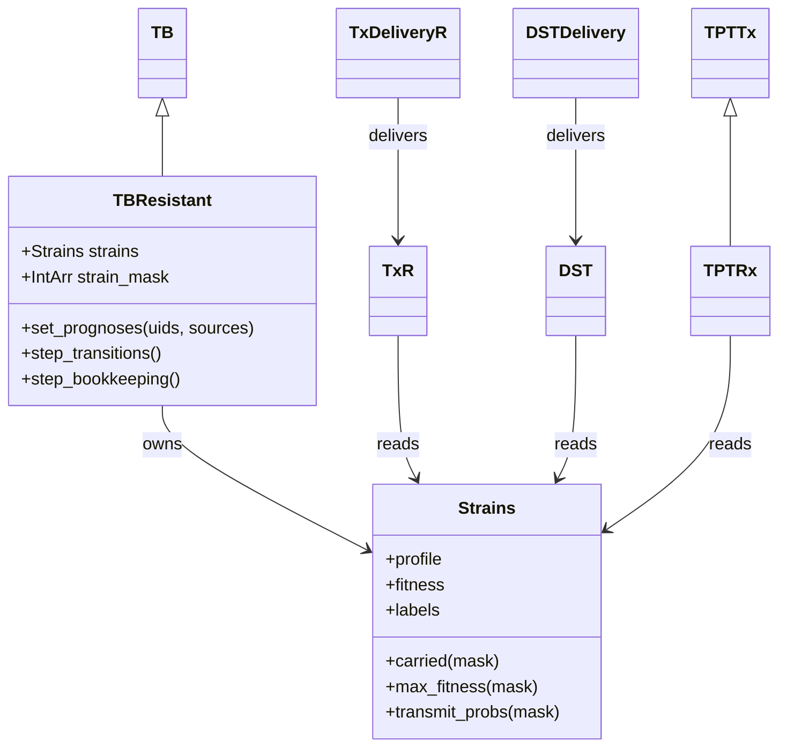
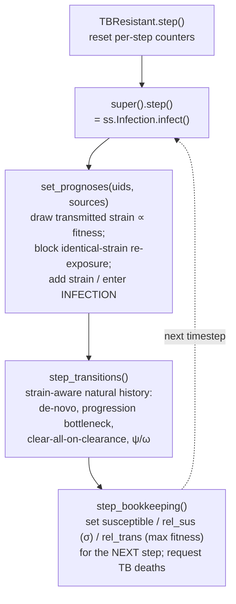

# TBsim drug-resistance: implementation reference

This document explains **how** the multi-strain / drug-resistance extension (`tbsim.resistance`) is implemented, feature by feature, as a companion to the technical specification ([tbsim-resistance-tech-spec.md](tbsim-resistance-tech-spec.md)) and the usage tutorial ([docs/tutorials/resistance_tutorial.qmd](../../../docs/tutorials/resistance_tutorial.qmd)). It is aimed at readers who want to understand or extend the code: it names the concrete classes, methods, parameters, and results, gives the design rationale, and shows validated example output. Every code snippet and figure here is generated from the implementation and its devtest suite.

## 1. Overview

The extension turns TBsim's single-strain TB model into a model of **circulating drug-resistant strains**. It is built on one architectural idea: rather than write a bespoke multi-strain transmission engine, it **reuses Starsim's common-random-number force-of-infection (FOI) engine** and layers a strain overlay on top of the existing agent-level TB state machine. Concretely:

- A **strain** is an `n`-bit resistance profile over an ordered drug set; for `n` drugs there are `m = 2ⁿ` strains (spec §"Individual strain resistance profiles").
- Each agent carries a **set** of strains, packed into a single integer per-agent bitmask (`strain_mask`), so an agent can be superinfected with any subset of the `m` strains.
- Transmission, superinfection, progression, clearance, de-novo mutation, treatment, DST, and TPT are all expressed as operations on that bitmask, mostly by setting the standard Starsim per-agent transmission arrays (`susceptible`, `rel_sus`, `rel_trans`) and resolving which strain moves in overridden hooks.

The deterministic **two-strain ODE** (`tbsim.compartmental.TwoStrainODE`, a port of `ode.r`) is the validation reference; §12 shows the agent-based model reproducing it.

## 2. Architecture at a glance

All resistance code lives in `tbsim/resistance/`:

| File | Public objects | Role |
|----|----|----|
| `strains.py` | `Strains` | The `2ⁿ` strain registry: profiles, fitness, labels, bit helpers |
| `tb_resistant.py` | `TBResistant` | Strain-aware TB disease module (natural history + transmission set-up) |
| `treatments.py` | `TxR`, `TxDeliveryR`, `treatment_monitoring_eligibility` | Strain-resolved treatment, acquisition-on-failure, monitoring/switching |
| `dst.py` | `DST`, `DSTDelivery` | Drug-susceptibility testing and DST-routed regimen eligibility |
| `tpt.py` | `TPTRx` | Strain-aware preventive therapy |
| `analyzers.py` | `ResistanceStats`, `StrainResults` | Resistance-origin decomposition and per-strain tracking |

Everything is re-exported at the top level, so `tbsim.TBResistant`, `tbsim.Strains`, `tbsim.TxR`, etc. all work. The disease module subclasses the core `tbsim.TB`; the treatment/DST/TPT classes follow TBsim's product/delivery pattern and (for TPT) subclass the existing `tbsim.TPTTx`.



## 3. Strain representation (`Strains`)

`Strains(drugs, rel_fitness=None)` is a pure lookup table — it owns no simulation state. It enumerates all `2ⁿ` strains as integer ids and precomputes their resistance profiles, transmission fitness, and human-readable labels.

```python
import tbsim
s = tbsim.Strains(drugs=['RIF', 'BDQ'], rel_fitness={'RIF': 0.5, 'BDQ': 0.8})
# s.n = 2, s.m = 4
# id 0 'pan'     profile [0 0]  fitness 1.00
# id 1 'RIF'     profile [1 0]  fitness 0.50
# id 2 'BDQ'     profile [0 1]  fitness 0.80
# id 3 'RIF+BDQ' profile [1 1]  fitness 0.40
```

**Encoding.** Strain id `j`'s resistance profile is the binary expansion of `j`: `profile[j, i] = bit i of j` = "strain `j` is resistant to drug `i`". So id 5 with drugs `['RIF','BDQ','FQ']` decodes to `{1,0,1}` = RIF+FQ. Per-drug fitness cost `r_i` comes from the name-keyed `rel_fitness` dict (default 1.0); a strain's `fitness[j]` is the product of `r_i` over the drugs it resists (pan-susceptible = 1.0). RIF/BDQ/FQ are just labels — nothing is hard-coded, and adding a drug is a one-line change to `drugs`. Inputs are validated (unknown drugs, out-of-range fitness, and duplicate names raise).

**Per-agent state.** An agent's carried set `Y_k` is one integer, `strain_mask` (bit `j` set = carries strain `j`; `0` = uninfected). This packs an arbitrary strain *set* into Starsim's 1-D `ss.IntArr` — Starsim has no native 2-D per-agent state. `Strains.carried(mask)` decodes a mask array back into an `(n_agents, m)` boolean membership matrix used everywhere downstream:

```
agent carrying {pan, RIF+BDQ}  →  bits 0 and 3 set  →  strain_mask = 0b1001 = 9
Strains.carried([9])           →  [[True, False, False, True]]   # strains 0 and 3
```

Key methods: `max_fitness(mask)` (per-agent fittest carried strain), `transmit_probs(mask)` (per-agent ∝-fitness distribution over carried strains), `phenotype_any(mask)` (per-agent OR of carried resistance profiles → the observable phenotype), `drug_bit(drug)`, and `drug_idx`.

## 4. The disease module (`TBResistant`)

`TBResistant(TB)` inherits the entire single-strain natural-history state machine (`TBS`: SUSCEPTIBLE → INFECTION → NON_INFECTIOUS → ASYMPTOMATIC → SYMPTOMATIC → TREATMENT/CLEARED/DEAD) and adds the strain overlay. The natural history stays **agent-level** — one `TB.state` per agent — and progression rates are strain-count-independent (spec §"Progression to disease"); strains ride on top.

`TBResistant.__init__` defaults the module `name` to `'tb'` so the standard TBsim interventions (which key on disease `'tb'`) integrate unchanged, and it resolves the spec's reinfection-coupling defaults (`rr_reinfection_inf` ← `rr_reinfection_rec`, `rr_reinfection_non` ← `rr_reinfection_inf`).

### Per-step execution

The base `TB.step()` was refactored into two hooks so `TBResistant` can override the natural history and the transmission set-up independently:



The crucial point: **`step_bookkeeping` sets the standard transmission arrays**, and the *next* step's `ss.Infection.infect()` consumes them to do the FOI arithmetic and call `set_prognoses` on the newly infected. The strain logic lives entirely in `set_prognoses`, `step_transitions`, and `step_bookkeeping`; the transmission engine itself is unchanged.

## 5. Transmission and superinfection

This is the reuse-the-FOI design in full (spec §"Transmission", §"Strain competition and protection against reinfection").

**`step_bookkeeping` sets three arrays:**

- `rel_trans = Strains.max_fitness(strain_mask)` — an infectious agent transmits at its **fittest** carried strain's rate. Superinfection therefore does not lower total infectiousness (spec's "relative effective contact rate = max fitness"). Asymptomatic agents are additionally scaled by `trans_asymp`.
- `susceptible` — set True for states eligible to (super)infect: SUSCEPTIBLE, CLEARED, INFECTION, NON_INFECTIOUS, and (only if their σ > 0) ASYMPTOMATIC / SYMPTOMATIC.
- `rel_sus` — the state-dependent superinfection susceptibility σ: `rr_reinfection_inf` (σ_L) for INFECTION, `rr_reinfection_non` (σ_N) for NON_INFECTIOUS, `rr_reinfection_asy`/`rr_reinfection_sym` for active disease, and the reinfection multiplier for CLEARED. σ is strain- and count-agnostic (a superinfected agent gains no extra protection).

**`set_prognoses(uids, sources)` resolves which strain moves.** For transmission events it draws the transmitted strain from each source's carried strains ∝ `count × fitness` (`Strains.transmit_probs`, sampled with the CRN-safe `tbsim.choice2d`), then:

- **identical-strain superinfection** — if the target already carries the drawn strain, its per-strain **count** is incremented (previously this was blocked); the infection clock resets and the event is counted in `new_identical_superinf`.
- otherwise the strain is OR-ed into the target's `strain_mask` at count 1; a previously-uninfected target enters INFECTION, while an already-infected target keeps its current state (superinfection).

The two spec constraints — infectees acquire only strains the source carries, and no resistance emerges during transmission — hold by construction. The design reproduces the spec's worked table exactly (a source carrying `{RIF}` and `{RIF,BDQ}` transmits at rate `r_RIF·β`, split 56% / 44%); see `devtests/test_transmission.py::test_transmission_split_matches_spec_table`.

## 6. Natural history: progression, clearance, and the superinfection modifiers

`step_transitions` overlays strain logic on the competing-risk transitions:

- **Progression bottleneck** (`_bottleneck`, spec §"Progression"): only at `→ ASYMPTOMATIC`, a multi-strain agent keeps all strains with probability `p_multi` (default 1); otherwise exactly one strain progresses, chosen with equal probability by default (`prog_select='random'`) or fitness-weighted (`prog_select='fitness'`). `INFECTION → NON_INFECTIOUS` retains all strains.
- **Clearance clears everything** (spec §"Clearance"): natural clearance/resolution (`INFECTION → CLEARED`, `NON_INFECTIOUS → CLEARED`) sets `strain_mask = 0` — immune-mediated clearance is strain-agnostic, in contrast to treatment/TPT which clear selectively.
- **Superinfection rate modifiers**: `rr_prog_super` (ψ, spec Q1) scales the progression rates of multi-strain agents; `rr_clear_super` (ω) scales their natural-clearance rate. Both default to 1.

## 7. De-novo resistance acquisition (`_denovo`)

At progression out of `INFECTION` (to NON_INFECTIOUS or ASYMPTOMATIC), each carried strain independently acquires resistance to each not-yet-resistant drug with probability `p_rand[drug]` (spec §"(Random) Acquisition"; `p_rand` is a per-drug dict, so RIF's rate can be 0 while another drug's is positive). The drug bits a source strain acquires this step combine into one resistant target strain, which is either **added** (`prog_resist_mode='mixed'` → superinfection, the default) or **swapped in** (`'replacement'`). Each drug has its own CRN stream so per-drug draws are independent.

Because the strain space is the full `2ⁿ`, the resistant target strain **always exists** — de-novo events are never silently dropped (a genuine advantage of the bitmask over an explicitly-enumerated strain list). Events feed the `new_denovo_resistance` result. `devtests/test_acquisition.py` verifies per-drug specificity, independent multi-strain mutation, and that mixed-vs-replacement matches the ODE.

## 8. Treatment (`TxR` + `TxDeliveryR`)

Treatment follows TBsim's product/delivery split (spec §"Treatment & (Selective) Acquisition").

**`TxR`** (product) holds the regimen's per-strain efficacy and acquisition rules:

- `eff_by_id[j]` = `base_efficacy` × ∏ `resist_penalty[d]` over the *regimen* drugs `d` that strain `j` resists. Resistance to a drug **outside** the regimen does not reduce efficacy. An explicit `efficacy_by_strain` vector (the spec's `T_l`) bypasses this derivation and sets `eff_by_id` verbatim.
- `adherence` gates the whole course through one per-agent completion draw, inducing the spec's agent-level correlation across strains (a non-completer clears nothing). It is either a float (one regimen-level probability shared by all agents) or a callable `uids -> per-agent probability` — the spec's "regimen-level distribution that varies by agent"; the callable's output is fed to the completion draw via `adherence_distribution`.
- `roll_survivors(tb, uids)` pre-rolls the surviving strain mask: for each carried strain, adherent carriers are cured with probability `eff_by_id`.
- `acquire(uids, surv, states)` applies acquisition-on-failure as **replacement**: once per agent per regimen drug, a surviving strain susceptible to that drug becomes resistant, with probability `q_acq[drug]` scaled by a per-TB-state RR (`acq_state_rr`, default 1 for ASYMPTOMATIC/SYMPTOMATIC and 0 elsewhere — the spec's state-varying `q`).

Together `roll_survivors` + `acquire` reproduce the ODE's treatment-outcome operator `π(m→s)` **exactly**, including the AB→B collapse when a failed superinfection acquires resistance; `devtests/test_treatment.py::test_treatment_operator_matches_ode_pi_table` checks all three cohorts against the ODE `pi_*` formulas.

**`TxDeliveryR`** (delivery) initiates treatment from the active states at state-specific rates (`rate_asym`, `rate_sym`) or from a custom `eligibility` callable, freezes the per-strain outcome at initiation, and resolves it after `dur_treatment`: fully cleared → CLEARED (with post-treatment reinfection protection), otherwise back to the state treated from, carrying the surviving (and possibly newly resistant) strains. Results: `n_treated`, `n_success`, `n_failure`, `n_acquired`.

### Treatment monitoring and mid-course switching

The spec's "prematurely stop/change an ongoing regimen" is realized by two composable pieces (spec §"Treatment monitoring"):

- `treatment_monitoring_eligibility(tx_name, after_steps, every_steps)` returns a `sim → uids` callable selecting agents who have been on a named course past a time-under-treatment threshold (tracked via `ti_treatment_start`).
- `TxDeliveryR.interrupt(uids)` prematurely stops *this* delivery's ongoing course for those agents, reverting them to their pre-treatment active state with strains intact. A second-line delivery given `supersedes=[first_line_name]` calls the first line's `interrupt` for its eligible on-treatment agents before starting them — so the switch actually fires. `devtests`/`tests` confirm agents are moved from first- to second-line mid-course.

## 9. Diagnostics (`DST` + `DSTDelivery`)

`DST` produces an **observed** `n`-bit phenotype from an agent's carried strains (spec §"Diagnostics & Treatment Modification"). It applies sensitivity/specificity **at the strain level** and aggregates:

- each carried strain is independently observed with probability `p_strain_obs` (a within-host/culture bottleneck; default = strain fitness as a bacillary-load proxy);
- each observed strain independently reads resistant (if truly resistant, w.p. `sens`) or false-positive (if susceptible, w.p. `1 − spec`);
- a drug is called resistant for the agent if **any** observed strain reads resistant.

Independent per-strain draws are essential: they make a phenotype carried by *several* strains **more** likely to be detected (`P = 1 − (1−sens)ᵏ`), exactly as the spec requires, and make `p_strain_obs < 1` genuinely reduce sensitivity via strain drop-out. `devtests/test_diagnostics_tpt.py` checks sens/spec recovery, the multi-strain detection boost, and the bottleneck.

`DSTDelivery` stores the observed profile (`dst_profile`) and exposes routing helpers: `observed_resistant(drug)` (single drug) and `matches(RIF=True, BDQ=False, ...)` (composable multi-drug), each returning `sim → uids` eligibility callables that resolve the sim's own DST instance at call time (copy-safe). Feed these to `TxDeliveryR(eligibility=..., supersedes=[...])` to route or switch regimens by observed phenotype.

## 10. Preventive therapy (`TPTRx`)

`TPTRx` subclasses the existing `tbsim.TPTTx` and makes sterilization **per strain** (spec §"TPT"): among agents in the sterilize branch it clears only strains susceptible to *every* regimen drug (`_covered_mask`), so a resistant strain in a co-infected latent agent **survives** and can later progress and transmit; the agent reaches CLEARED only once no strain remains. This is the Mills–Cohen "preventive therapy unmasks resistance" dynamic — a less-fit resistant strain that would be out-competed on its own gains share when INH clears the susceptible strain it competes with:


TPT-driven resistance **acquisition** is applied to the "TPT was ineffective" cohort via `_apply_neither_branch` (a small hook added to the base `TPTTx`): a susceptible carried strain mutates to its resistant counterpart at per-drug rate `p_tpt_acq[drug]`, scaled by a per-TB-state RR whose defaults follow the spec's gradient (INFECTION 0.05, NON_INFECTIOUS 0.5, ASYMPTOMATIC/SYMPTOMATIC 1.0). Use `TPTRx` inside any TPT delivery, e.g. `tbsim.TPTSimple(product=tbsim.TPTRx(...))`, with `p_sterilize > 0`.

## 11. Results and analyzers

`TBResistant` records, alongside the standard TB results: `frac_resist` (resistant fraction of active TB), `frac_super` (superinfected fraction), `frac_resist_<drug>` (per drug), and the three per-step flux counters `new_identical_superinf`, `new_denovo_resistance`, `new_transmitted_resistance`.

Two analyzers add cross-cutting views:

- **`ResistanceStats`** collates the spec's key mechanistic output (§11 "resistance origin decomposition") — new resistance split into **de-novo**, **treatment-acquired**, and **transmitted** flux — and exposes `to_df(sim)`. In a treated epidemic, transmission dominates once resistance is established, seeded and topped up by de-novo and treatment-acquired events:


- **`StrainResults`** records per-strain active-TB counts (`n_active_<label>`), for resolution over individual strains beyond the aggregate `frac_resist_<drug>`.

## 12. Validation against the two-strain ODE

The agent-based model is validated against `tbsim.compartmental.TwoStrainODE` (a port of `ode.r`, verified bit-identical to the R reference). The two share the LSHTM natural-history rates exactly; the ABM's per-edge network `β` is calibrated once to the ODE's single-strain endemic prevalence (`devtests/ode_utils.py`), then both are seeded identically and compared. The ABM tracks the deterministic ODE across the reduction check, competitive exclusion, and treatment-driven selection:


Beyond these, `devtests/` checks each spec "question of interest" *directionally against the ODE* — does the ABM shift the observable the same way the reference does when a knob moves off its null? The concise CI-level equivalences (single-strain reduction, strain symmetry, conservation, the treatment operator) live in `tests/test_resistance.py`; the fuller, ODE-anchored suite is `tbsim/resistance/devtests/`.

Regenerate the figures with `python tbsim/resistance/docs/make_implementation_figs.py`.

## 13. Parameter reference

`TBResistant` resistance parameters (on top of the base `tbsim.TB` parameters):

| Parameter | Symbol | Meaning | Default |
|----|----|----|----|
| `rr_reinfection_inf` | σ_L | superinfection susceptibility while INFECTION | `rr_reinfection_rec` |
| `rr_reinfection_non` | σ_N | superinfection susceptibility while NON_INFECTIOUS | = σ_L |
| `rr_reinfection_asy` | σ_A | superinfection susceptibility while ASYMPTOMATIC | 0 |
| `rr_reinfection_sym` | σ_Y | superinfection susceptibility while SYMPTOMATIC | 0 |
| `p_multi` | p_multi | prob. all strains co-progress at → ASYMPTOMATIC | 1 |
| `prog_select` | (h_A,h_B) | strain selected under the bottleneck: `'random'` or `'fitness'` | `'random'` |
| `rr_prog_super` | ψ | progression-rate multiplier for multi-strain agents | 1 |
| `rr_clear_super` | ω | natural-clearance multiplier for multi-strain agents | 1 |
| `p_rand` | p_rand_i | per-drug de-novo acquisition prob. at progression (dict) | none |
| `prog_resist_mode` | — | de-novo mechanism: `'mixed'` or `'replacement'` | `'mixed'` |
| `init_strains` | — | probability vector over strain ids for seeded infections | id 0 |

`TxR`: `base_efficacy`, `resist_penalty` (per-drug dict), `adherence`, `q_acq` (per-drug dict), `acq_state_rr`, `regimen_drugs`. `TxDeliveryR`: `rate_asym`, `rate_sym`, `dur_treatment`, `eligibility`, `supersedes`. `DST`: `sens`, `spec` (scalar or per-drug dict), `p_strain_obs`. `TPTRx`: `regimen_drugs`, `p_tpt_acq`, `acq_state_rr` (+ the base `TPTTx` `efficacy`/`p_sterilize`/durations).

## 14. Mapping to the spec's questions of interest

The spec's "questions of interest" (model-tests.md §10) are each a knob on this one model:

| # | Question | Knob | Status |
|----|----|----|----|
| 1 | Faster progression with superinfection | `rr_prog_super` (ψ) | ✅ implemented |
| 2a | Progression bottleneck | `p_multi` | ✅ implemented |
| 2b | Selection rule when one strain progresses | `prog_select` | ✅ implemented |
| 3a | Superinfection eligibility (INFECTION vs +NON_INFECTIOUS) | `rr_reinfection_inf`, `rr_reinfection_non` | ✅ implemented |
| 3b | Superinfection during active disease | `rr_reinfection_asy`, `rr_reinfection_sym` | ✅ implemented |
| 4 | De-novo acquisition mechanism (mixed vs replacement) | `prog_resist_mode` | ✅ implemented |
| 5 | Transmission bottleneck vs independence | — | ⚠️ bottleneck only |
| 6 | Repeated/identical-strain superinfection | — | ✅ per-strain count (`new_identical_superinf`) |

**Q5 is the one deliberate gap.** The bitmask + reuse-FOI design implements only the transmission *bottleneck* (a superinfected source transmits at its fittest strain's rate, then one strain is drawn ∝ `count × fitness`). Fully independent per-strain transmission would require per-strain FOI channels, which the shared-engine design does not provide; it remains available in the ODE (`transmission_independent`) as the reference for that question. Q6 is now implemented: identical-strain re-exposure increments a per-strain multiplicity count (rather than being blocked), feeding the transmission multinomial and the progression bottleneck.

## 15. Design decisions and known limitations

- **Bitmask vs. declared strains.** The `2ⁿ` bitmask matches the spec's model exactly and guarantees that de-novo/acquired resistance always has a target strain (no silently-dropped emergence). The cost is that the strain-membership decode is `O(m)`; this is negligible for the spec's realistic drug counts (`n ≈ 2–4` → 4–16 strains) but would grow for many independent drugs.
- **Adherence** supports both a single regimen-level probability (float) and a per-agent distribution (callable) applied across all of an agent's strains — the spec's "regimen-level distribution that varies by agent."
- **Within-strain DST correlation.** Sensitivity/specificity for the several drugs of one strain share that strain's call draw (a minor, deliberate correlation); independence *across* strains — what drives the multi-strain detection boost — is preserved.
- **Rate-based treatment delivery.** `TxDeliveryR` initiates at state-specific rates (which cleanly matches the ODE and supports DST-routing / switching via `eligibility` + `supersedes`); it does not retrofit the full HealthSeekingBehavior → Dx → Tx cascade, though a custom `eligibility` callable can bridge to it.
- **Burden validation.** A resistance-off vs resistance-on burden-per-100,000 comparison (spec §"Testing") is generated by `codex_review/make_burden_validation.py` → `lai_tpt_burden_validation.csv`.

See [resistance_comparison.md](resistance_comparison.md) for how these choices compare to the alternative PR #430 implementation.
