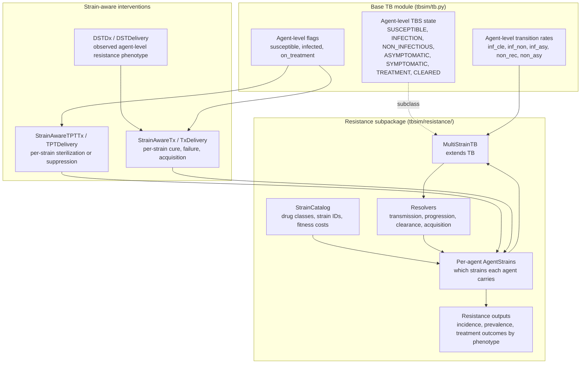
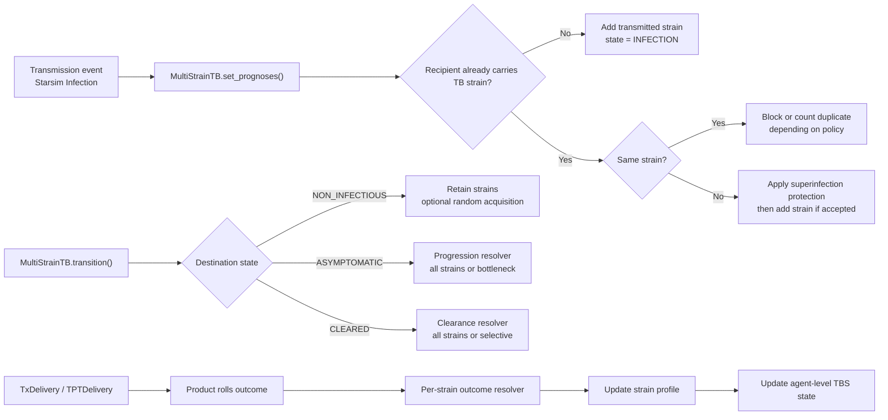
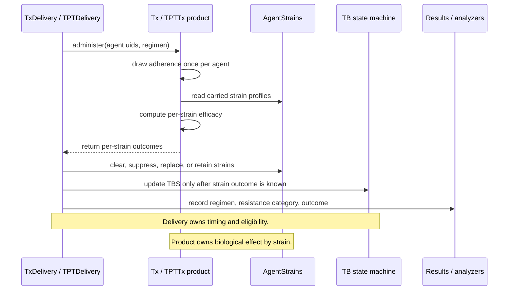
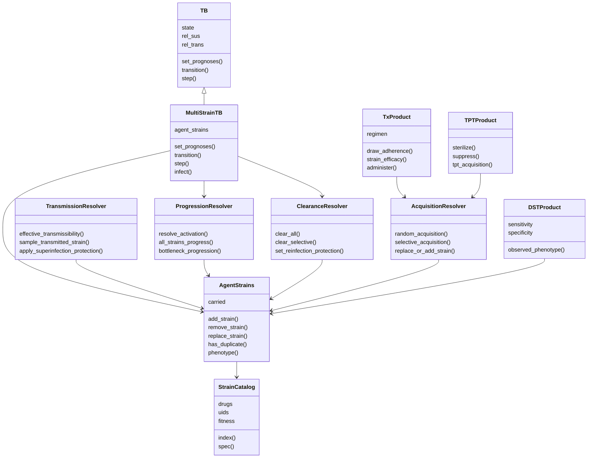
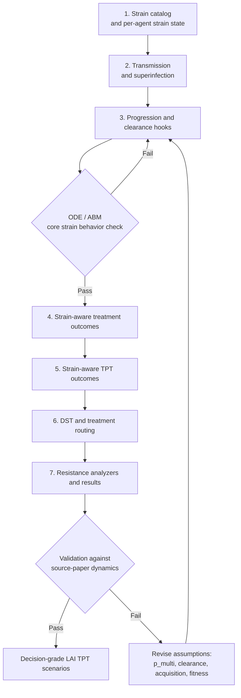
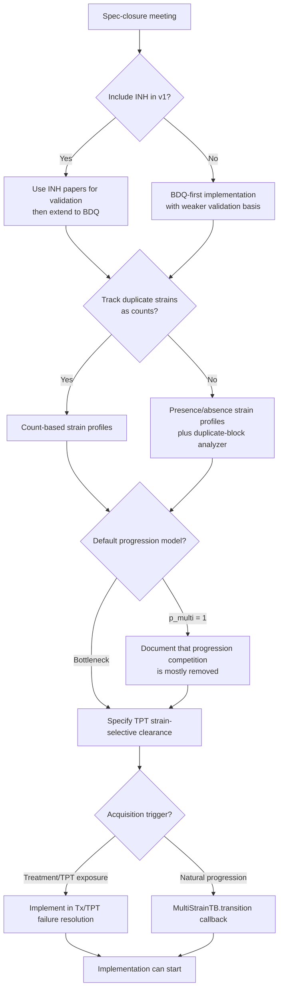

# TBsim Resistance Tech Spec: Implementation Findings

This document is an implementation-focused review of the TBsim resistance technical specification from the perspective of refactoring the current `tbsim` codebase.

It focuses on:

- decision points that should be closed before implementation,
- questions for the spec authors,
- comments on where the current code will need to change,
- suggested refactor boundaries and build order.

The review assumes resistance should be added as a multi-strain overlay on the existing `TB` natural-history model, not as a replacement for the current `TBS` state machine.

## Context

The resistance spec is written by TB researchers/modelers and is scientifically detailed, but several parts are not yet implementation-ready. The main gap is that the spec describes general-purpose drug resistance machinery, while the near-term decision appears to be much more specific: evaluating whether long-acting injectable, bedaquiline-based TPT could increase drug-resistant TB incidence.

The current codebase is agent-level:

- `tbsim/tb.py` stores one TB natural-history state per agent in `TB.state` (base `TB` only; no strain overlay).
- `tbsim/resistance/multistrain_tb.py` provides `MultiStrainTB`, a subclass that adds per-agent strain state and strain-aware hooks.
- Base `TB.set_prognoses()` treats each new infection as a transition into `TBS.INFECTION`, with no strain identity.
- `MultiStrainTB.set_prognoses()` branches new vs superinfection and assigns transmitted strains.
- Base `TB.transition()` changes only the agent-level disease state; `MultiStrainTB.transition()` adds progression/clearance strain logic.
- `TPTTx` sterilization clears the whole latent infection.
- `TxDelivery.step_success()` clears the whole infection after treatment success.
- `TxDelivery.step_failures()` restores the prior agent-level state after failure.

The spec requires strain-level behavior layered on top of those agent-level states via `MultiStrainTB`.

## Executive Summary

Resistance is implemented as `AgentStrains` (`MultiStrainTB.agent_strains`) — per-agent strain state on `MultiStrainTB`, not base `TB`. The three strain layers — `StrainSpec` (config), `StrainCatalog` (catalog), and `AgentStrains` (runtime) — all live in `tbsim/resistance/strains.py`. The disease entry point is `from tbsim.resistance import MultiStrainTB`.

The largest implementation risk is not the amount of code, but committing too early to defaults that encode unresolved scientific decisions. Once treatment, TPT, DST, results, and analyzers depend on a strain representation, changing the core assumptions will be expensive.

### Notes from the bitmask prototype

The earlier bitmask implementation is useful as a compact mathematical prototype, especially for two-strain ODE validation, but it should not replace the production overlay architecture in this branch.

Its core representation is a bitmask: a single integer per agent where bit `j` means "carries strain `j`". For example, binary `0101` means the agent carries strains 0 and 2. This is efficient for a small, fixed strain universe, and it makes some ODE operator tests concise.

This branch deliberately uses named Starsim state arrays instead:

- `AgentStrains` creates one `ss.BoolArr` per strain (`carries_pan`, `carries_inh_r`, etc.).
- `StrainSpec` keeps strain definitions explicit and named.
- `StrainCatalog` provides indexed tables for fast lookup without exposing users to binary encodings.

Recovered or recoverable pieces from the prototype:

- `ResistanceStats`, the ODE-facing analyzer that collates `frac_resist`, `frac_super`, `flux_denovo`, `flux_txacq`, and `flux_transmitted` — now implemented in `tbsim/resistance/analyzers.py` against `MultiStrainTB`.
- `TwoStrainODE`, the deterministic reference model for ABM-vs-ODE validation — now ported to `tbsim/compartmental/two_strain_ode.py`.
- The validation scripts and directional ODE tests remain recoverable after translating from the bitmask prototype API to `MultiStrainTB`/`AgentStrains`.
- Compact operator tests such as the two-strain treatment outcome table; the treatment-operator requirement has already been recovered through `Regimen(resistance_penalty=...)` and intervention tests.

Do not recover wholesale:

- The old bitmask disease class as a replacement for `MultiStrainTB`.
- The bitmask runtime state.
- Treatment, DST, or TPT code directly, since those implementations are tightly coupled to the bitmask representation.

The most important unresolved decisions are:

1. Whether INH is included in the first implementation.
2. Whether mixed infections progress through a bottleneck by default.
3. Whether duplicate-strain superinfection is merely monitored or structurally represented.
4. How TPT acts on mixed-strain latent infections.
5. Whether random acquisition is truly a disease-progression event or should be tied to treatment/TPT exposure.

## Visual Overview

### Proposed Resistance Overlay

The key design principle is to keep the existing `TBS` disease state as the agent-level natural-history state and add strain state beside it.



### Refactor Boundaries

This diagram shows where the resistance logic should land in the current codebase.



## Current Codebase Pressure Points

**As shipped:** strain hooks are implemented on `MultiStrainTB`
(`tbsim/resistance/multistrain_tb.py`); base `TB` is unchanged. The notes
below describe the pre-implementation baseline and where the overlay attaches.

### Base `TB.set_prognoses()` / `MultiStrainTB.set_prognoses()`

Base ``TB`` behavior (unchanged):

```python
super().set_prognoses(uids, sources)
self.susceptible[uids] = False
self.infected[uids] = True
self.ever_infected[uids] = True
self.ti_infected[uids] = self.ti
self.state[uids] = TBS.INFECTION
```

Implementation implication (addressed on ``MultiStrainTB``):

``MultiStrainTB.set_prognoses()`` branches new vs superinfection,
calls ``_assign_transmitted_strains``, and blocks duplicate strains.

### Base `TB.transition()` / `MultiStrainTB.transition()`

Base ``TB`` behavior:

`TB.transition()` chooses a destination `TBS` state and applies the state change immediately.

Implementation implication (addressed on ``MultiStrainTB``):

``MultiStrainTB.transition()`` calls ``_apply_strain_progression`` for
progression/clearance strain logic; resolvers mutate ``agent_strains`` in place.

### Natural-History Event Flow

```mermaid
stateDiagram-v2
    [*] --> SUSCEPTIBLE
    SUSCEPTIBLE --> INFECTION: transmission assigns strain
    INFECTION --> CLEARED: natural clearance resolver
    INFECTION --> NON_INFECTIOUS: retain strains
    INFECTION --> ASYMPTOMATIC: progression resolver
    NON_INFECTIOUS --> CLEARED: spontaneous resolution resolver
    NON_INFECTIOUS --> ASYMPTOMATIC: progression resolver
    ASYMPTOMATIC --> NON_INFECTIOUS: agent-level transition; strains retained
    ASYMPTOMATIC --> SYMPTOMATIC: agent-level transition; strains retained
    SYMPTOMATIC --> ASYMPTOMATIC: agent-level transition; strains retained
    SYMPTOMATIC --> DEAD: clear or retire strain profile

    note right of INFECTION
        Strain profile exists beside TBS state.
        Natural history remains agent-level.
    end note

    note right of ASYMPTOMATIC
        Activation is where p_multi vs
        bottleneck matters most.
    end note
```



### Base `TB.step()` / `MultiStrainTB.step()`

Base ``TB`` behavior:

`TB.step()` evaluates transitions from `INFECTION`, `NON_INFECTIOUS`, `ASYMPTOMATIC`, and `SYMPTOMATIC`, then updates agent-level flags.

Implementation implication:

The existing state machine should remain agent-level. Resistance logic should be layered into:

- transmission setup,
- transition resolution,
- results collection,
- intervention-driven strain updates.

Avoid creating separate natural histories per strain unless the spec changes substantially. The spec explicitly says natural history remains agent-level.

### `TPTTx`

Current behavior:

`TPTTx` already has a useful product-level split between sterilization and suppression:

- `efficacy` determines whether TPT works,
- `p_sterilize` determines sterilization vs suppression among efficacious agents,
- sterilization clears agents still in `TBS.INFECTION`,
- suppression applies agent-level `rr_activation`, `rr_clearance`, and `rr_death` modifiers.

Implementation implication:

This should be extended, not replaced. The product should return per-strain outcomes:

- cleared,
- suppressed,
- unchanged,
- acquired resistance.

The delivery class should continue to own who receives TPT and when the course completes.

### `Tx` and `TxDelivery`

Current behavior:

`Tx.administer()` rolls adherence and success at the agent level. `TxDelivery` stores pending success/failure flags and resolves them after treatment duration.

Implementation implication:

The current architecture already has the right product/delivery split. The necessary refactor is to make product outcomes strain-aware while preserving agent-level treatment state:

- draw adherence once per agent per regimen episode,
- compute per-strain efficacy conditional on strain strain,
- allow partial clearance,
- keep agent in the prior active TB state if at least one strain remains,
- apply selective resistance acquisition on unsuccessful treatment outcomes.

### Treatment and TPT Outcome Flow



## Must-Close Decisions Before Core Refactor

### 1. Phase I Drug Categories

The spec lists RIF and BDQ as starting categories and defers INH.

Implementation comment:

INH should be included in the first implementation if the team wants to validate against Cohen, Mills, and Kunkel. The published source literature is mostly INH-centered. Without INH, the team can build BDQ machinery but cannot reproduce the known INH-resistance dynamics first.

Decision needed:

- Is Phase I `RIF + BDQ`, or `INH + RIF + BDQ`?

Recommendation:

Use `INH + RIF + BDQ` for the first strain catalog unless there is a strict timeline constraint. Treat BDQ as the decision-relevant extension after INH validation.

### 2. Strain Representation

The spec uses binary resistance profiles for each drug/class and allows agents to carry multiple strains.

Implementation options:

- fixed matrix: `n_agents x n_strains`,
- variable-length strain lists per agent,
- count-based strain representation,
- hybrid aggregate phenotype plus internal strain IDs.

Implementation comment:

For Phase I, a fixed-width strain matrix is probably simplest and fastest if the number of drug classes stays small. With three drug classes, there are eight strains. With four, there are sixteen. That is manageable.

Decision needed:

- What is the maximum number of drug classes expected in v1?
- Does the model need to count repeated infections with the same strain, or only track presence/absence?

Recommendation:

Start with a strain catalog and a fixed per-agent presence matrix for Phase I. Revisit count-based representation only if duplicate-strain blocking bias is expected to be material.

#### 2a. Generalizing the strain classes beyond TB

`StrainSpec`, `StrainCatalog`, and `AgentStrains` were designed for TB drug
resistance but are structurally generic: each strain is a named entity with a
binary phenotype vector and a fitness weight. The classes have been extended
in place (not forked) so that other multi-strain overlays — e.g. HIV subtypes
or ART-resistance profiles — can reuse them.

Change summary:

- `StrainSpec` accepts `phenotype=` (generic) as an alias for `resistance=`
  (TB). Internally the data is stored on `self.phenotype`; `self.resistance`,
  `self.drugs`, and `self.markers` are aliases that return the same dict.
- `StrainCatalog` accepts `markers=` as an alias for `drugs=`, and exposes
  both `self.phenotype`/`self.resistance` (2D array) and
  `self.markers`/`self.drugs` (column names).
- `AgentStrains` needed no changes — its per-strain `carries_<uid>` state
  and fitness-weighted transmission are already disease-agnostic.

Why aliases instead of a rename:

- TB code (regimens, DST, resolvers, Tx/TPT) actively interprets the
  phenotype as drug resistance. Renaming would either break every TB
  script/test or force parallel APIs in those modules.
- Non-TB overlays can build directly on the strain classes without
  carrying "resistance" language into their vocabulary.
- Only the *strain data model* is made generic. Disease-specific behaviour
  still lives in disease-specific modules — a hypothetical HIV overlay
  supplies its own connector, resolvers, and interventions rather than
  reusing `ResistanceConnector`.

"Phenotype" is used here in the modelling sense: the observable / modelled
traits of a strain — a fixed-length 0/1 vector — rather than the underlying
genotype. For TB it is the drug-resistance profile; for HIV it could be
subtype or ART-resistance flags.

### 3. Duplicate-Strain Superinfection

The spec proposes blocking superinfection with an identical strain, while adding an analyzer to count how often this happens.

Implementation comment:

An analyzer diagnoses the bias but does not fix it. Blocking duplicate strains can favor rare resistant strains because common susceptible strains are more likely to be wasted on agents who already carry them.

This matters for BDQ because baseline BDQ resistance may be rare, and the project is specifically concerned with emergence of resistance.

Decision needed:

- Is it acceptable to monitor duplicate-strain blocking only?
- What quantitative threshold would make the bias unacceptable?
- Should counts of repeated strain exposure be represented from the start?

Recommendation:

Do not treat this as a purely implementation-level detail. Either implement strain counts or define an explicit bias threshold for the analyzer.

### 4. Transmission From Superinfected Agents

The spec says each transmission event passes one strain. For superinfected agents, total infectiousness equals the fittest strain, and the transmitted strain is sampled from a multinomial distribution.

Implementation comment:

This is implementable, but it is a modeling choice. The alternative, independent per-strain transmission, would reduce competition and change the biology. The spec should state why the fittest-strain model is preferred.

Decision needed:

- Is the fittest-strain transmission model the default for ABM implementation?
- Is ODE test #5 a gate before implementation or only a sensitivity test?

Recommendation:

Use the fittest-strain model as the default if the goal is to preserve competition between strains, but document that rationale in the spec.

### 5. Progression Bottleneck and `p_multi`

The spec allows mixed infection to progress to multi-strain active disease with probability `p_multi`. It suggests starting with `p_multi = 1`.

Implementation comment:

`p_multi = 1` is easy to implement but may weaken the core competitive mechanism in the source literature. If all strains progress together, then TPT clearing one susceptible strain matters less for which strain becomes active.

Decision needed:

- What is the default value of `p_multi` if ODE tests are inconclusive?
- Should progression bottleneck weights be equal across strains or weighted by strain fitness?

Recommendation:

Implement progression as a strategy/resolver, with at least two modes:

- `all`: all strains progress,
- `bottleneck`: one strain progresses.

Do not hard-code `p_multi = 1` into the first implementation.

### 6. Natural Clearance

The spec assumes that natural clearance from `INFECTION` or spontaneous resolution from `NON_INFECTIOUS` clears all strains.

Implementation comment:

This is easy to code but scientifically consequential. It removes some selective dynamics that are central in the source literature.

Decision needed:

- Is all-strain natural clearance an intentional simplifying assumption?
- Should selective natural clearance be included as a sensitivity option?

Recommendation:

Implement clearance through an explicit clearance resolver, even if the first default is all-strain clearance. This avoids embedding a hard-to-change assumption in `MultiStrainTB.step()`.

### 7. Random Acquisition Timing

The spec models random/endogenous acquisition as a one-time probability during transition from `INFECTION` to `NON_INFECTIOUS` or `ASYMPTOMATIC`.

Implementation comment:

The spec gives efficiency as one reason for avoiding per-timestep rates. That should not drive the scientific model. Acquisition can be checked sparsely on transitions or treatment events without looping over every person every timestep.

Decision needed:

- Should random acquisition occur during natural progression?
- Should it instead be restricted to treatment or TPT exposure?
- Which drugs/classes have zero or nonzero random acquisition probabilities?

Recommendation:

Separate the biological trigger from the computational implementation. If random acquisition remains progression-triggered, implement it as a transition callback.

### 8. Selective Acquisition on Treatment Failure

The comment thread appears to resolve that each surviving susceptible strain should have an independent probability of acquisition, and acquisition should replace the strain with a resistant version.

Implementation comment:

This should be moved from comments into the spec body before implementation.

Decision needed:

- Does acquisition apply independently to all surviving susceptible strains?
- Can multiple drugs be acquired in one failure episode?
- What happens if one strain is cleared and another acquires resistance in the same treatment episode?

Recommendation:

Implement selective acquisition in treatment failure resolution, after strain-level treatment outcomes are known.

### 9. Agent-Level Treatment Efficacy Correlation

The spec notes that adherence should induce agent-level correlation across strains.

Implementation comment:

This aligns well with the current `Tx` architecture. Draw adherence once per agent per regimen episode, then apply that adherence effect across all strains for that agent.

Decision needed:

- Is per-episode adherence correlation sufficient for v1?
- Should persistent agent-level adherence traits across treatment episodes be deferred?

Recommendation:

Implement regimen-episode correlation now. Defer persistent adherence traits.

### 10. TPT Per-Strain Mechanics

The TPT section is the most important under-specified part of the spec.

Implementation comment:

The LAI BDQ decision depends on TPT. The current code has a strong starting point because it already separates sterilization and suppression, but it acts at agent level. Resistance requires per-strain TPT effects.

Decision needed:

- Does TPT clear all susceptible strains or only one targeted strain?
- Does TPT suppression apply to all strains or only susceptible strains?
- Does a resistant strain remain unaffected by regimen-specific TPT?
- Does TPT failure create resistance in latent, non-infectious, asymptomatic, and symptomatic states at different rates?
- Does post-TPT protection persist after selective strain clearance?

Recommendation:

Create a dedicated TPT resistance subsection in the spec. Do not implement TPT resistance from the current short paragraph.

### 11. DST and Treatment Routing

The spec says DST creates an observed strain per agent, not per strain.

Implementation comment:

This fits the current diagnostic architecture, but it has edge cases for mixed infection. If an agent carries both susceptible and resistant strains, aggregate DST positivity does not identify which strain is resistant.

Decision needed:

- Should DST observe any resistance if any strain is resistant?
- Should DST sensitivity vary by strain abundance or dominance?
- Can DST return indeterminate results?
- Does DST happen immediately after diagnosis, after failure, or both?

Recommendation:

Keep DST as a separate diagnostic product from TB-state diagnostics. It should output observed agent-level drug resistance phenotype, while internal strain state remains hidden.

### 12. Treatment Monitoring and Regimen Switching

The spec suggests treatment monitoring may extend or change regimens while treatment is ongoing.

Implementation comment:

Current `TxDelivery` pre-rolls treatment outcomes and resolves them at treatment completion. Premature regimen switching would require canceling or superseding pending outcomes.

Decision needed:

- Is in-flight regimen switching required in v1?
- If so, how should pending success/failure/relapse states be invalidated?

Recommendation:

Defer treatment monitoring and in-flight switching unless required for the first LAI analysis. Implement resistance biology first.

## Questions for Spec Authors

### Scientific Questions

1. Should INH be included in v1 for validation against the source papers?
2. What default should be used for `p_multi`?
3. If `p_multi < 1`, how should the dominant progressing strain be selected?
4. Should fitness costs apply only to transmission or also to progression bottlenecks?
5. Should natural clearance remove all strains or selectively remove strains?
6. Is random acquisition a natural-history progression event or a treatment/TPT exposure event?
7. What baseline BDQ resistance prevalence should be used in the India-like Phase I scenario?
8. What plausible range should be used for BDQ fitness cost?
9. How should TPT affect mixed latent infection?
10. Does TPT preserve post-clearance immunity, and is that immunity agent-level or strain-specific?

### Implementation Questions

1. Should resistance live inside `TB` behind a feature flag, or in a `TBResistance` subclass during development?
2. Should agent strain state be stored as fixed-width arrays or variable-length objects?
3. Should repeated exposure to an already-carried strain be counted as a strain count, or only logged by an analyzer?
4. Should products return per-strain outcomes, or should delivery classes compute per-strain outcomes?
5. Should DST results be stored on people, on the diagnostic product, or on a resistance-specific diagnostic state?
6. What are the minimum outputs needed for the LAI TPT decision?

### Validation Questions

1. Which source-paper figures should the ODE tests reproduce?
2. Are ODE tests a gate before ABM implementation?
3. What qualitative behavior is considered sufficient validation for INH?
4. What evidence review is needed before BDQ-specific calibration?
5. How should epidemic trajectory sensitivity be represented?

## Recommended Architecture

### Core Principles

1. Keep `TBS` as the single agent-level natural-history state.
2. Add strain state beside `TB.state` on `MultiStrainTB`, not inside the enum.
3. Preserve the product/delivery pattern for treatment and TPT.
4. Keep scientific choices as explicit strategy methods or parameters.
5. Avoid hard-coding assumptions that are still under discussion.

### Proposed Components

#### Component Sketch



#### `StrainSpec`, `StrainCatalog`, and `AgentStrains` (`tbsim/resistance/strains.py`)

All three are implemented in a single module:

| Class | Layer | Responsibility |
|-------|-------|----------------|
| `StrainSpec` | Config | One strain's uid, resistance dict, fitness, `init_prev` |
| `StrainCatalog` | Catalog | Ordered uids, drug list, `resistance` / `fitness` / `init_prev` arrays |
| `AgentStrains` | Runtime | Per-agent `carries_<uid>` `ss.BoolArr` on `MultiStrainTB` |

Flow: `StrainSpec (×N) → StrainCatalog → AgentStrains`. See
[resistance_architecture.md §1.1](resistance_architecture.md#11-strainspec-vs-straincatalog-vs-agentstrains).

#### `StrainCatalog`

Responsible for:

- drug/class names,
- mapping binary resistance profiles to strain IDs,
- fitness values,
- helper methods for adding resistance to a strain.

Example conceptual API:

```python
catalog = StrainCatalog(drugs=['INH', 'RIF', 'BDQ'])
pan = StrainSpec('pan', {'INH': 0, 'RIF': 0, 'BDQ': 0})
bdq_r = StrainSpec('bdq_r', {'INH': 0, 'RIF': 0, 'BDQ': 1})
```

#### Per-Agent Strain State

Responsible for:

- which strains each agent carries,
- which strain(s) are active if needed,
- duplicate-strain detection,
- clearing or replacing strains.

Phase I can likely use a boolean array with shape `n_agents x n_strains`.

#### Transmission Resolver

Responsible for:

- computing effective transmissibility from carried profiles,
- sampling one transmitted strain from superinfected infectors,
- applying strain-specific fitness costs,
- handling duplicate-strain superinfection.

#### Progression Resolver

Responsible for:

- retaining all strains on `INFECTION -> NON_INFECTIOUS`,
- applying `p_multi` or bottleneck logic on activation,
- optionally weighting the bottleneck by fitness.

#### Clearance Resolver

Responsible for:

- all-strain natural clearance,
- selective natural clearance if needed,
- pathway-specific reinfection protection.

#### Acquisition Resolver

Responsible for:

- random acquisition, if retained,
- selective acquisition on treatment/TPT failure,
- strain replacement vs strain addition.

#### Strain-Aware `Tx`

Responsible for:

- regimen drug/classes,
- per-strain efficacy,
- per-agent adherence draw,
- per-strain success/failure output,
- relapse scheduling if success is full or partial.

#### Strain-Aware `TPTTx`

Responsible for:

- per-strain TPT efficacy,
- sterilization vs suppression,
- post-TPT protection,
- TPT-driven acquisition risk.

#### DST Product

Responsible for:

- observed strain by drug/class,
- sensitivity/specificity by drug/class,
- aggregate agent-level phenotype for routing.

## Suggested Build Order

### Build Order Drawing



### 1. Add strain catalog and per-agent strain state

Build this first without changing treatment, TPT, or diagnostics. Add minimal tests for:

- strain enumeration,
- adding a strain to an agent,
- replacing a strain with a resistant version,
- clearing all strains,
- detecting duplicate strains.

### 2. Implement transmission and superinfection

Add:

- transmitted strain assignment,
- superinfection protection,
- duplicate-strain blocking or counting,
- fittest-strain effective transmission model.

Keep treatment/TPT out of scope at this stage.

### 3. Add progression and clearance hooks

Add:

- `p_multi` strategy,
- bottleneck strategy,
- all-strain natural clearance,
- optional selective clearance strategy.

This is the point where ODE/ABM behavior should be compared for core strain competition.

### 4. Refactor treatment outcomes

Update `Tx` and `TxDelivery` so treatment can:

- draw adherence once per agent,
- resolve per-strain cure,
- leave agents in disease state if strains remain,
- apply selective acquisition on failure.

### 5. Refactor TPT outcomes

Update `TPTTx` so TPT can:

- clear susceptible strains selectively,
- suppress progression,
- preserve or remove post-clearance protection according to spec,
- apply state-dependent acquisition on TPT failure.

This should be prioritized before DST if the near-term decision is LAI TPT.

### 6. Add DST and treatment routing

Add DST only after internal strain behavior is stable. DST should observe aggregate resistance phenotype and drive regimen selection.

### 7. Add analyzers and results

Minimum outputs:

- prevalence by strain,
- active TB by resistance category,
- incidence by resistance category,
- treatment starts by regimen and resistance category,
- treatment failures by regimen and resistance category,
- TPT starts and TPT outcomes by strain category,
- duplicate-strain superinfection events blocked or counted.

### 8. Add validation harness

Before using outputs for the LAI decision, validate against:

- source-paper qualitative dynamics,
- ODE tests from the spec,
- epidemic trajectory sensitivity,
- burn-in and calibration behavior with resistance enabled.

## Priority Findings

### P1: Blockers Before Implementation

- Include or explicitly exclude INH from v1.
- Decide strain storage representation.
- Resolve `p_multi` default and bottleneck behavior.
- Decide whether duplicate-strain superinfection bias is acceptable.
- Specify TPT per-strain mechanics.
- Define minimum validation targets.

### P2: Resolve Before ODE to ABM Handoff

- Selective acquisition rules in superinfected treatment failure.
- Natural clearance all-strain vs selective.
- Random acquisition trigger and per-drug probabilities.
- Fitness costs on progression.
- Agent-level adherence correlation across strains.

### P3: Resolve Before Decision-Grade Outputs

- BDQ-specific parameterization.
- Epidemic trajectory sensitivity.
- DST observation model.
- Treatment monitoring and regimen switching.
- Calibration and burn-in strategy with resistance enabled.

## Implementation Comments for the Spec

### Move the notation disclaimer to the top

The spec says software can diverge from the notation, but that statement appears late. It should be near the top so implementers know the array notation is conceptual rather than prescriptive.

### Separate scientific assumptions from implementation details

Statements about computational efficiency should not be used as scientific justification. If an acquisition event is biologically a rate, the implementation can still evaluate it efficiently at sparse events.

### Fold resolved comment threads into the main spec

The spec should not require implementers to inspect comment threads to know the intended behavior. In particular:

- treatment efficacy should use regimen-level adherence applied across strains,
- selective acquisition should apply independently to surviving susceptible strains,
- unresolved disagreements around `p_multi` and superinfection tests should be explicitly marked.

### Treat TPT as a first-class section

The current TPT section is too short for the decision it needs to support. It should have the same level of detail as treatment:

- efficacy by strain,
- sterilization vs suppression,
- acquisition risk,
- post-TPT protection,
- mixed-infection behavior,
- state-specific differences.

### Define validation before implementation

The spec lists ODE tests, but it should say what those tests are expected to validate. At minimum, define qualitative behaviors or figures from source papers that should be reproduced before ABM outputs are used for decisions.

## Proposed Near-Term Meeting Agenda

Use one short spec-closure meeting to resolve:

1. Phase I drug classes.
2. Strain representation and duplicate-strain policy.
3. Default progression bottleneck behavior.
4. TPT behavior in mixed infection.
5. Acquisition triggers and treatment failure rules.
6. Minimum validation targets.

These decisions are enough to unblock a stable implementation plan.

### Spec-Closure Decision Tree



## Bottom Line

The current `tbsim` architecture can support the resistance spec, but only if resistance is treated as a strain-level overlay with explicit resolver methods at transmission, progression, clearance, treatment, and TPT events.

The most important implementation advice is to avoid embedding unresolved scientific defaults into core data structures. Close the strain representation, INH inclusion, progression bottleneck, duplicate-strain handling, and TPT mechanics before starting the core refactor.


If the goal is to make the resistance-profile concept more concrete in the spec, I'd suggest something like this.

| Drug/Class             | Variable | 0           | 1         | Notes                                        |
| ---------------------- | -------- | ----------- | --------- | -------------------------------------------- |
| Isoniazid              | `xINH`   | Susceptible | Resistant | Useful for validating against IPT literature |
| Rifampicin             | `xRIF`   | Susceptible | Resistant | Often used as MDR-TB marker                  |
| Fluoroquinolones       | `xFQ`    | Susceptible | Resistant | Important for pre-XDR/XDR definitions        |
| Bedaquiline            | `xBDQ`   | Susceptible | Resistant | Relevant to LAI TPT and future regimens      |
| Clofazimine (optional) | `xCFZ`   | Susceptible | Resistant | Often paired with BDQ resistance discussions |
| Linezolid (optional)   | `xLZD`   | Susceptible | Resistant | Relevant for advanced DR-TB regimens         |
| Other Companion Drug   | `xDrugN` | Susceptible | Resistant | Placeholder for future extension             |

Then resistance profiles become:

| Profile       | Representation | Interpretation                   |
| ------------- | -------------- | -------------------------------- |
| Pan-sensitive | `{0,0,0,0}`    | Susceptible to all modeled drugs |
| INH-R         | `{1,0,0,0}`    | Resistant to INH only            |
| RIF-R         | `{0,1,0,0}`    | Resistant to RIF only            |
| MDR           | `{1,1,0,0}`    | Resistant to INH and RIF         |
| Pre-XDR       | `{1,1,1,0}`    | MDR + FQ resistant               |
| BDQ-R         | `{0,0,0,1}`    | Resistant to BDQ only            |
| MDR + BDQ-R   | `{1,1,0,1}`    | MDR with BDQ resistance          |

From a software-engineering perspective, I would actually recommend adding a table like this to the spec:

| Concept            | Example                                                                     |
| ------------------ | --------------------------------------------------------------------------- |
| strain | `{xINH:1, xRIF:0, xFQ:0, xBDQ:1}`                                           |
| Agent Profile Set  | `[{xINH:0,xRIF:0,xFQ:0,xBDQ:0}, {xINH:1,xRIF:0,xFQ:0,xBDQ:1}]`              |
| Meaning            | Agent carries both a pan-sensitive profile and an INH+BDQ-resistant profile |

because it makes the later sections on:

* superinfection
* transmission
* acquisition
* DST
* treatment selection

much easier to reason about.

In fact, this table would support your earlier comment about clarifying whether a **strain** is really a biological strain or simply a **strain**, because the data structure becomes much more explicit.
